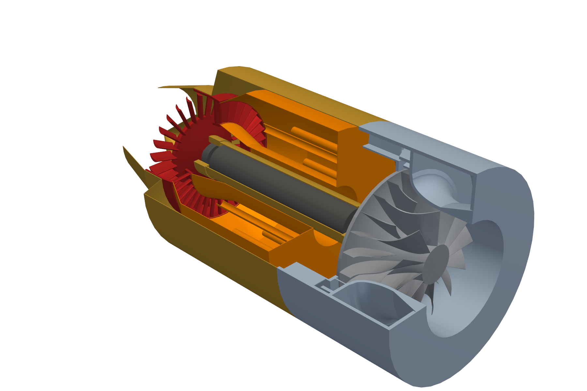
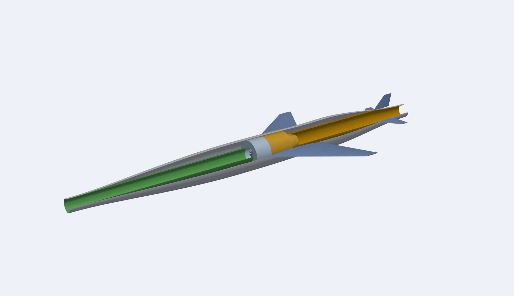
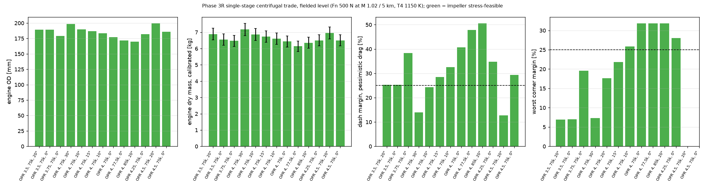
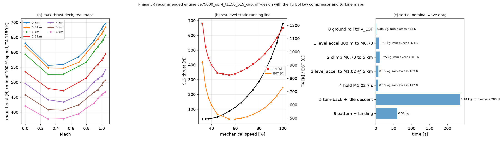
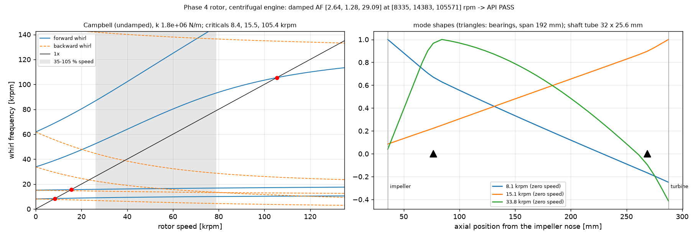
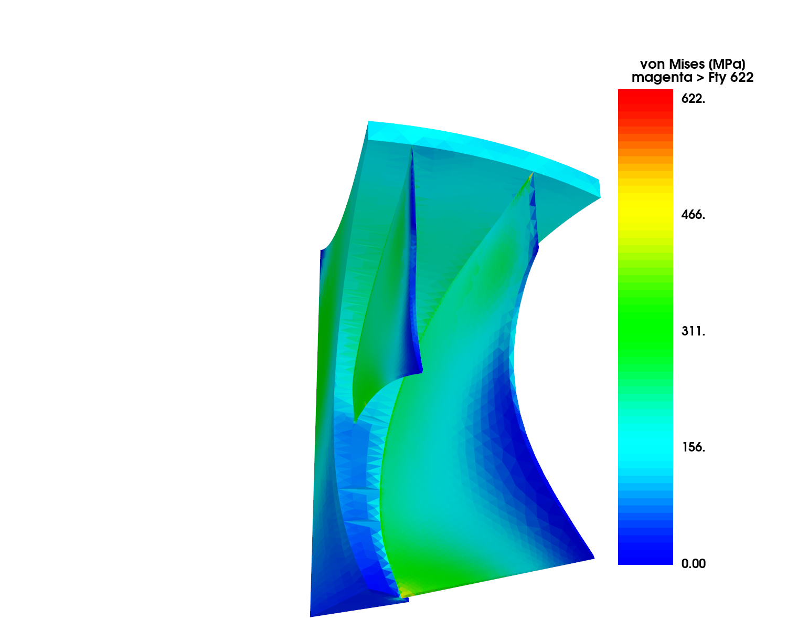

# boomsonic

**A 500 N-class turbojet and a ≤ 25 kg supersonic airframe, designed from first principles with open-source tools.**

Conceptual design study for an aircraft that must reach and hold **Mach 1** under the Boom Prize rules.
Design point: **500 N net thrust at M 1.02, 5 000 m ISA**.



*Single-spool turbojet: centrifugal impeller and vaned diffuser (grey), annular vaporiser combustor (orange),
single-stage axial turbine (red). 187 mm diameter, 426 mm long, 6.85 kg.*

---

## Status

This is a **student learning project** and a **conceptual study**. Every number comes from a tool run or a cited
handbook relation, and the whole chain is reproducible from this repository — but **nothing has been built or
tested on hardware**, and several questions that decide whether this design survives are still open. They are
listed in [Open risks](#open-risks) and stated in full in [`docs/design_freeze.md`](docs/design_freeze.md).

Phases 0–6 are complete: requirements → airframe sizing → cycle and architecture trade → turbomachinery and rotor
dynamics → design freeze → CAD and 3D FE.

---

## What it came out as

### Engine — single-stage centrifugal turbojet

| | |
|---|---|
| Architecture | single spool: centrifugal compressor, annular combustor, axial turbine, convergent nozzle |
| Overall pressure ratio | 4.0 |
| Turbine inlet temperature | 1150 K |
| Airflow | 1.326 kg/s |
| TSFC | 0.164 kg/(N·h) |
| Spool speed | 75 000 rpm (105 % MCS = 78 750 rpm) |
| Impeller | Ti-6Al-4V, 12 main + 12 splitter blades, −15° exit backsweep, boreless hub |
| Impeller tip speed | 525 m/s (552 m/s at MCS) |
| Diffuser | vaneless gap, then 19 radial vanes to R4/R2 = 1.35, then axial deswirl |
| Turbine | single-stage axial, IN-713LC, 34 NGV / 28 rotor blades |
| Envelope / dry mass | **187 mm × 426 mm / 6.85 kg** |
| Sea-level static thrust | 631 N at 98.2 % speed (T4-limited) |

Efficiencies are quoted at the **fielded** level (η_c 0.70, η_t 0.75, η_b 0.95) — the level calibrated to reproduce
the TSFC of real commercial micro-turbojets, not the optimistic level the design tools predict.

### Aircraft — 0.30 m² wing, nose-pitot intake

| mass item | kg |
|---|---|
| engine (calibrated) | 6.85 |
| engine accessories | 1.60 |
| structure | 3.82 |
| landing gear + drag chute | 1.27 |
| fuel system | 0.40 |
| systems, avionics, instrumentation | 2.02 |
| growth allowance (15 %) | 1.13 |
| fuel (sortie + reserve + unusable) | 2.98 |
| **TOGW** | **20.09** |
| **margin to the 25 kg limit** | **4.91** |

| performance | nominal wave drag | pessimistic wave drag |
|---|---|---|
| **dash thrust margin at M 1.02 / 5 km** (target +25 %) | **+54.7 %** | **+28.5 %** |
| brake release to M 1.02 at 5 km | 27.7 s | 27.9 s |
| minimum excess thrust, transonic acceleration | 177 N | 116 N |
| 3 g sustained turn at M 0.9 / 5 km | +283 N | +283 N |
| ground roll / landing (flaps + chute) | 46 m / 175 m | |

> The **worst corner** (η_c 0.66, combustor +1σ, pessimistic drag) gives **+21.8 %, below the 25 % target.**
> It has not been re-run on the Phase 4 engine.



*Airframe with the intake duct (green), engine (grey/orange) and jetpipe (yellow). 2.7 m long, 217 mm fuselage
diameter, engine face at x = 1.315 m.*

---

## Selected results

### Architecture trade — why centrifugal

The Phase 3R trade swept OPR, spool speed and exit backsweep, screening each design for impeller stress feasibility
before evaluating it. Bars are engine diameter, calibrated dry mass, dash margin at pessimistic drag, and worst-corner
margin. The chosen point is OPR 4 / 75 krpm / −15°.



### Off-design on real component maps

Thrust deck, sea-level-static running line and the flown sortie — computed in pyCycle with **TurboFlow-generated
compressor and turbine maps**, not placeholder map shapes.



### Rotor dynamics

Campbell diagram and mode shapes for the 32 × 25.6 mm tube shaft on damped supports. Three criticals at
8 335 / 14 383 / 105 571 rpm with amplification factors 2.64 / 1.28 / 29.09 — an **API-style separation-margin check
passes**, with the running range (grey) clear of the first two.



### 3D impeller stress

Cyclic-sector FE of the impeller passage, von Mises against Ti-6Al-4V minimum yield (622 MPa at temperature).
The exducer blade root sits on its limit by construction; the 3D model confirms the 1D sizing.

<p align="center"></p>

More figures in [`plots/`](plots/) — constraint diagram, drag polar, area distribution, mass budget, cycle trade,
backsweep sweep, turbo-design cross-check, critical-speed map, and the CAD renders.

---

## Open risks

None of these is resolved. They are the reason this is a snapshot and not a closed design.

| risk | status |
|---|---|
| **Compressor surge margin** — no validated prediction method exists for a vaned-diffuser stage of this type. The peak-of-characteristic surrogate **failed its only validation** against NASA HECC data (measured 8.4 % vs surrogate ≥ 73 %). | **OPEN — top risk** |
| **Surge margin in the idle range** — 8.4–8.7 % on the ground running line; a start/handling bleed was proposed but never sized or integrated. | OPEN |
| **Combustor shortened 20 %** for rotor dynamics; combustion performance unverified at the shorter length. | OPEN |
| **Diffuser vane count excites the exducer at idle** — a live high-cycle-fatigue concern until the vane count is redesigned. | OPEN |
| **No rig or bench test.** Nothing here has been validated on hardware. | OPEN |
| Exducer root at yield at MCS by construction; turbine on its 350 MPa root limit; damped bearing cartridge not designed. | carried |

---

## How it was done

Every phase ends by handing the next decision to a human; nothing proceeds without that. Every non-trivial decision
is logged in [`design_log.md`](design_log.md) with the tool, the inputs, the outputs and why the choice won.

**Ground rule: no guessing.** Where a tool could not answer a question, that is recorded rather than filled in.

Tools are verified against closed-form or published results *before* being trusted, and the defects found along the
way are documented in [`tools_survey.md`](tools_survey.md) — including a genuine bug in TurboFlow's centrifugal slip
model (it takes `cos` of an angle in degrees), which is patched at run time and evidenced by a dedicated script.

| tool | used for |
|---|---|
| [pyCycle](https://github.com/OpenMDAO/pyCycle) / OpenMDAO | thermodynamic cycle, off-design, engine deck |
| [TurboFlow](https://github.com/turbo-sim/TurboFlow) | centrifugal compressor and axial turbine meanline design + maps |
| [turbo-design](https://github.com/nasa/turbo-design) (NASA) | independent centrifugal cross-check |
| [TurboDesigner](https://github.com/Turbodesigner/turbodesigner) | axial compressor meanline |
| [Cantera](https://cantera.org/) | combustion, real-gas check |
| [ADRpy](https://github.com/sobester/ADRpy) / [AeroSandbox](https://github.com/peterdsharpe/AeroSandbox) | constraint diagram, drag build-up |
| [ROSS](https://github.com/petrobras/ross) | rotor dynamics |
| [CadQuery](https://github.com/CadQuery/cadquery) + gmsh + scikit-fem | CAD, meshing, 3D FE |

---

## Repository layout

```
scripts/       phase0_tools/          tool smoke tests and verification
               phase1_requirements/   operating point and mission
               phase2_airframe/       constraint diagram, drag, mass budget
               phase3_cycle/          cycle model, architecture trade, centrifugal design
               phase4_turbomachinery/ maps, operability, stress, rotor dynamics
               phase6_cad/            CAD, 3D FE, rendering
               phase7_afterburner/    afterburner cycle, envelope, nozzle trade, closure
docs/          one report per phase; design_freeze.md is the status snapshot
data/          generated results (committed)
plots/         generated figures
cad/           STEP solids (engine_assembly.step, engine_with_afterburner_assembly.step)
axial/         the axial + axial-centrifugal branch, self-contained
```

The **axial branch is kept separate** under [`axial/`](axial/README.md). A 6-stage axial engine was taken to its own
freeze for comparison; it is not the baseline, and which architecture goes forward is still an open decision.
Keeping it in its own tree means axial numbers cannot leak into continued centrifugal work.

## Running it

Python 3.12 via [`uv`](https://github.com/astral-sh/uv), in three virtual environments (ADRpy and TurboFlow need
NumPy 1; pyCycle and the CAD stack need NumPy 2).

```powershell
uv venv --python 3.12 .venv      ; $env:VIRTUAL_ENV="$PWD\.venv";     uv pip install -r requirements-np2.txt
uv venv --python 3.12 .venv-np1  ; $env:VIRTUAL_ENV="$PWD\.venv-np1"; uv pip install -r requirements-np1.txt
uv venv --python 3.12 .venv-cad  ; $env:VIRTUAL_ENV="$PWD\.venv-cad"; uv pip install -r requirements-cad.txt
```

Check the toolchain, then reproduce the baseline engine:

```powershell
.venv\Scripts\python scripts\phase0_tools\smoke_pycycle.py                          # toolchain check
.venv\Scripts\python scripts\phase3_cycle\cc_trade.py run 4.0:75000:-15             # the baseline engine
.venv\Scripts\python scripts\phase3_cycle\cc_mission.py ce75000_opr4_t1150_b15_cap  # deck + sortie on real maps
.venv\Scripts\python scripts\phase4_turbomachinery\cc_closure.py                    # airframe mass closure
```

Phase 7 (afterburner) — verify first, then the study:

```powershell
.venv\Scripts\python scripts\phase7_afterburner\verify_ab_cycle.py      # regression + closed form + Cantera
.venv\Scripts\python scripts\phase7_afterburner\ab_envelope.py --regress # dry deck vs the frozen deck
.venv\Scripts\python scripts\phase7_afterburner\ab_design_point.py      # Tt7 sweep, duct Mach, thermal choking
.venv\Scripts\python scripts\phase7_afterburner\ab_envelope.py          # how far past Mach 1, on real maps
.venv\Scripts\python scripts\phase7_afterburner\ab_hardware.py          # diffuser, flameholder, Cantera stability
.venv\Scripts\python scripts\phase7_afterburner\ab_nozzle_trade.py      # three nozzle concepts + fixed reference
.venv\Scripts\python scripts\phase7_afterburner\ab_closure.py           # mass and 25 kg closure
.venv-cad\Scripts\python scripts\phase7_afterburner\ab_cad.py          # CAD: engine_with_afterburner_assembly.step
.venv-cad\Scripts\python scripts\phase7_afterburner\ab_render.py       # plots/phase7_ab_cutaway.png, _section.png
```

Full per-phase command reference: [`docs/running_the_code.md`](docs/running_the_code.md).

## Documents

| | |
|---|---|
| [`turbojet_500N_mission_brief.md`](turbojet_500N_mission_brief.md) | the brief and its binding ground rules |
| [`docs/design_freeze.md`](docs/design_freeze.md) | **status snapshot: the design and every open risk** |
| [`docs/phase3r_centrifugal.md`](docs/phase3r_centrifugal.md) | cycle and centrifugal compressor design |
| [`docs/phase4r_centrifugal.md`](docs/phase4r_centrifugal.md) | maps, operability, stress, rotor dynamics |
| [`docs/phase6_cad.md`](docs/phase6_cad.md) | CAD, 3D FE, airframe integration |
| [`docs/phase7_afterburner.md`](docs/phase7_afterburner.md) | afterburner: +79 % thrust, what actually caps the envelope, the nozzle trade |
| [`design_log.md`](design_log.md) | every decision, with numbers |
| [`tools_survey.md`](tools_survey.md) | tool survey and the defects found |
| [`axial/README.md`](axial/README.md) | the axial branch |
