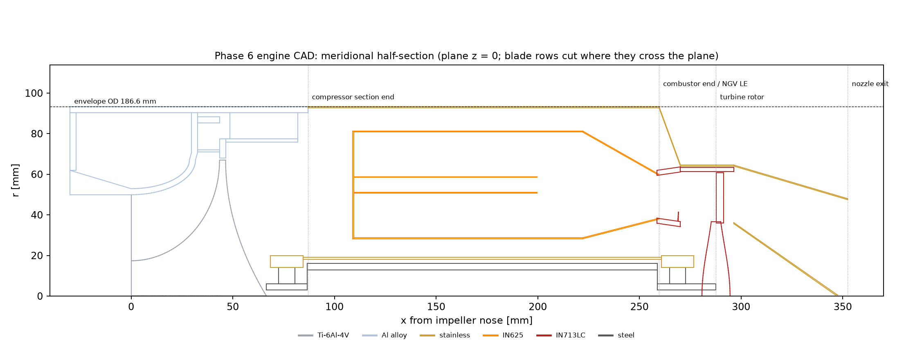
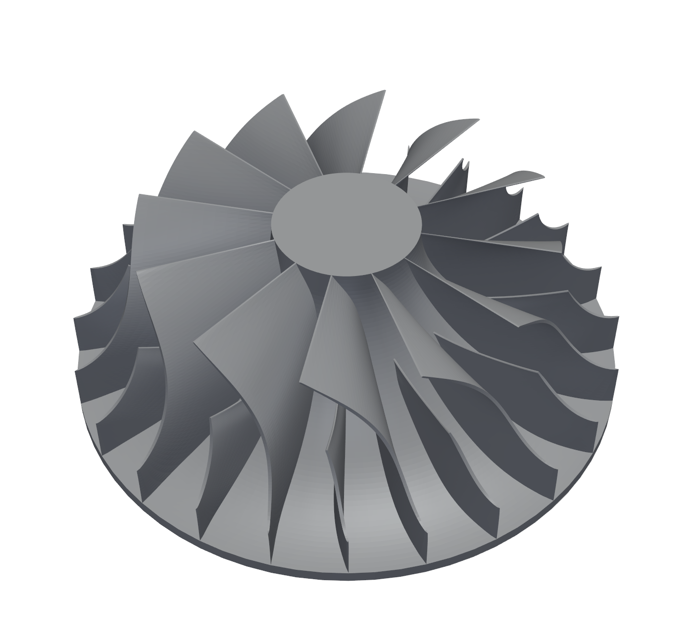
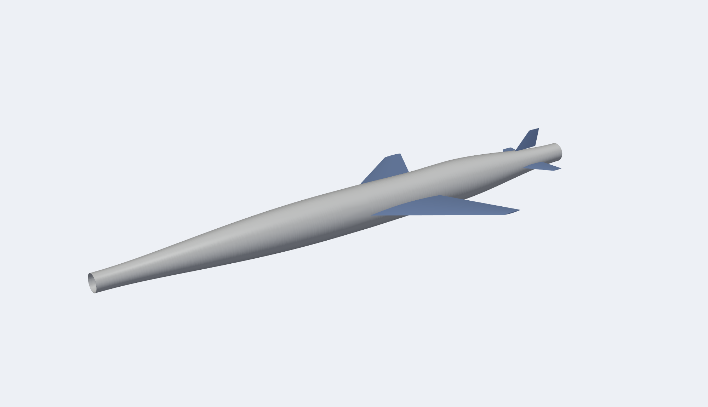
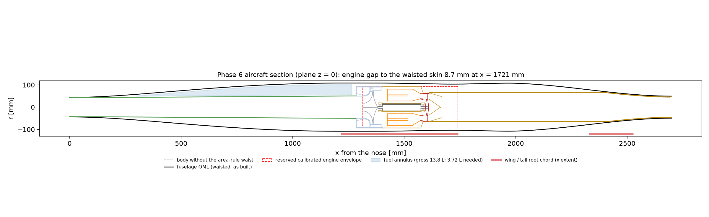

# Phase 6: CAD and 3D check of the frozen design (2026-09-14)

**Scope confirmed by the user:**
* toolchain: CadQuery + pyturbo-aero + gmsh;
* coverage: engine + airframe + 3D impeller FE;
* the freeze's open items modelled **parametrically**, so they stay open.

This phase draws the Phase 5 design and checks it in 3D. **It does not resolve any open risk of the freeze** (section 8
restates them). Decision log: `design_log.md` D6.0–D6.6. Tool findings: `tools_survey.md` section 9.

---

## 1. Summary

| what | result |
|---|---|
| parameter sheet | 74 engine parameters, **29 provisional** (diffuser, combustor, shaft / bearings, impeller camber and LE) |
| engine CAD | 27 valid solids, OD 186.6 mm (= envelope); components 352.5 mm long (382.5 mm with the 30 mm inlet lip); calibrated envelope 426 mm kept as a reserved volume |
| engine mass | CAD **5.19 kg** vs 4.92 kg for the same items in the raw bottom-up model (+5 %); item split off by −49 % … +53 %; calibrated 6.85 kg not contradicted |
| impeller CAD | 12 + 12 blades, smooth B-spline blades on the stress model's hub; **1.082 kg**; metal angles within 1.1° of the law; root / tip 2.23 / 0.80 mm |
| inducer throat | first CAD camber: **1 % choke margin** (requirement 10 %). New camber law (radial-fibre inducer + exducer backsweep, n = 3): **10.2 %** |
| 3D FE, exducer root | hot spot **413–426 MPa**, × Kt 1.4 = **578–596 MPa** vs the plate model's 618 and Fty 622: sizing confirmed, still on the limit |
| 3D FE, inducer root | **355–360 MPa**, 1.8 × the gate's 1D estimate (196 MPa); × Kt 1.4 = 497–505 MPa, ~25 % under Fty |
| 3D FE, hub | **331–333 MPa** vs 313 MPa axisymmetric (+6 %) |
| 3D FE, tip | closes 0.074 mm toward the casing (mechanical) vs 0.25 mm clearance |
| airframe | engine-to-skin gap **8.7 mm** at the area-rule waist; jetpipe ΔPt/Pt ≈ **0.64 %** (not in the cycle); fuel fits (27 % of the forebody annulus) |

---

## 2. Toolchain and how it was verified

`.venv-cad` (Python 3.12, `requirements-cad.txt`):
* CadQuery 2.8.0 / OCCT 7.9.3;
* gmsh 4.15.2;
* pyturbo-aero 1.3.8;
* scikit-fem 12.0.2, meshio;
* added in this phase: **pyamg 5.3.0**, **pypardiso 0.4.7** (MKL PARDISO).

| check | result |
|---|---|
| CAD primitives (`smoke_cad.py`) | box / STEP round trip, B-spline patch area, loft volume, gmsh mesh volume: exact to rounding |
| blade-row lofts (`cadlib.blade_row`) | single-vane volume = section area × height within 0.1 % |
| impeller blades | smooth solids pass through every pyturbo grid point within 1e-5 mm |
| impeller sector | volume closure 3e-5; 12 × hub sector = hub to 2e-8 |
| TurboFlow choke criterion (hand reproduction) | throat 0.70 → 1.086, 0.75 → 1.164 × design flow at tool level (Phase 3R bracket) |
| 3D FE (A) rotating disc | centre −0.2 %, outer-band hoop −0.05 % vs theory |
| 3D FE (B) hub alone vs verified axisymmetric FE | peak −1.2 %, mean hoop +0.1 % |
| 3D FE (B′) same hub, curved passage cuts | identical to (B); cyclic tie exact to 2e-9 mm |
| solvers | AMG vs SuperLU 1e-7 (B); PARDISO vs SuperLU 5e-7 (B′); production residual ~1e-11 |

Problems found in the tools, all in `tools_survey.md` section 9:
* pyturbo:
  * its camber cannot give the TE angle and the throat together;
  * its surfaces are Beziers built on control points;
  * its splitter is not offset;
  * five further code defects.
* OCCT booleans on faceted solids fail silently.
* gmsh periodic meshing needs matching topology.
* AMG stalls with the tie; SuperLU runs out of memory.

Each problem was caught by a check (volume, overlap, residual, mesh quality), not by eye.

---

## 3. Parameter sheet (`scripts/phase6_cad/make_params.py`)

`data/phase6/engine_params.json` and `airframe_params.json`: every value carries `{value, unit, status, source}`.
* **Frozen:** taken from the freeze.
* **Derived:** computed from frozen values (e.g. zero-incidence LE angles, C1 = 200.2 m/s).
* **Provisional:** a construction rule no analysis fixed. These are:
  * the diffuser (19 vanes, R4/R2 1.35, the deswirl placeholder);
  * the combustor (OD, liners, 150 mm liner, vaporisers);
  * the shaft / bearings / span / tunnel / damper;
  * the impeller LE radius and camber law.

The airframe inputs were stale Phase 2 values and were updated:
* capture area 47.5 → **55.1 cm²**;
* nozzle area 49.1 → **70.8 cm²**.

The drag model with them changes CDS by −0.3 % nominal and −1.0 % pessimistic, which is negligible, so the closure was not
re-run.

---

## 4. Engine CAD (`engine_cad.py`)

**Envelope rule made explicit by the CAD:**
* the diffuser OD (r4 + 3 mm) sets the engine OD;
* so the 90° bend from the radial diffuser into the axial deswirl annulus has to turn **inside r4**;
* the diffuser back plate therefore ends at the deswirl inner radius.

Any diffuser redesign (freeze 4.1 / 4.4) moves this bend.

**Mass, CAD vs the raw bottom-up model** (`mass_compare.py`, `data/phase6/mass_compare.csv`). The CAD is compared with
the raw model because the ×1.20 calibration covers the items the CAD does not draw: flanges, fasteners, seals, starter,
manifold.

| item | model raw [kg] | CAD [kg] | CAD / model |
|---|---|---|---|
| impeller | 0.924 | 1.082 | 1.17 |
| shroud / inlet | 0.442 | 0.524 | 1.19 |
| diffuser + deswirl | 0.389 | 0.199 | **0.51** |
| outer casing (compressor + hot) | 0.726 | 1.112 | **1.53** |
| combustor liners + vaporisers | 0.536 | 0.551 | 1.03 |
| NGV vanes / rings | 0.102 / 0.138 | 0.109 / 0.140 | 1.07 / 1.01 |
| turbine blades / disc / shroud | 0.106 / 0.280 / 0.201 | 0.111 / 0.281 / 0.163 | 1.05 / 1.00 / 0.81 |
| nozzle cones | 0.101 | 0.104 | 1.02 |
| shaft | 0.577 | 0.424 | **0.73** |
| tunnel + housings / bearings | 0.347 / 0.050 | 0.324 / 0.063 | 0.93 / 1.26 |
| **drawn items** | **4.919** | **5.187** | **1.05** |
| starter, fuel manifold + igniter, 10 % fasteners | 0.778 | not drawn | |
| total raw / calibrated | 5.697 / 6.85 | | |

Reading: the total is consistent, but the model's item split is not what the geometry gives.
* The casing (3 mm Al + 0.6 mm steel shells over the full length) is heavier than the model assumed.
* The diffuser plates are lighter.

Both casing and diffuser are provisional parts, and their wall thicknesses are not stress-sized.

---

## 5. Impeller CAD (`impeller_cad.py`)

**Inducer throat: a gap found between the meanline design and a drawable blade.**
* The Phase 3R throat was TurboFlow's `area_throat_ratio` 0.75, opened at tool level until +10 % flow was unchoked. The
  0.75 is a fraction of the tool-level eye.
* On the larger fielded eye the same 10 % margin needs **0.665 × eye**, using TurboFlow's own isentropic criterion
  reproduced by hand.
* The first CAD camber (blade angle linear in m′) gave **0.611 × eye = 1 % margin**.
* pyturbo's own camber could not fix it: one TE θ for all spans made the short shroud camber hook from 43° to 15° in
  the last 10 % of chord.

**Camber law adopted (provisional, traceable to the stress model):**
* **θ = θ_rf(x) + θ_bs(r).**
* Radial-fibre inducer, θ_rf′(x) = (ω/C1)(1 − x/L)^n:
  * zero incidence at every LE radius simultaneously;
  * no centrifugal bending of the inducer.
* Exducer backsweep rising linearly in r from 0 at 0.7 r2 to 15°, the plate model's law. This puts 15° at the TE on
  every span.
* **n = 3** is the smallest exponent giving the 10 % margin (n 2 / 2.5 / 3 → 1.040 / 1.072 / **1.102** × design).
* The consequence is rapid inducer unloading: the shroud metal angle goes from 62.8° at the LE to 42.8° at 30 % chord.
  **The inducer loading and diffusion this implies are not analysed (no CFD): new open item N1.**

**Checks** (`data/phase6/impeller_cad_checks.json`):

| check | result |
|---|---|
| metal angle vs the law, along the chord | max deviation 1.1° (hub), 0.9° (mid), 0.7° (shroud) |
| TE metal angle over the last grid segment (TE rounding) | 11.6 / 13.1 / 14.2° hub / mid / shroud (law there 13.9 / 14.4 / 14.8°) |
| thickness at the root / tip | 2.23 / 0.80 mm (sized 2.235 / 0.8) |
| throat / choke flow | 0.667 × eye / **1.102 × design flow** |
| wheel mass, Ip, Id, CG | 1.082 kg (hub 0.944, blades 0.138); 1.287e-3 / 8.29e-4 kg m²; 36.2 mm from the nose |
| hub vs the axisymmetric stress model | 0.9440 vs 0.9436 kg |

* The stress model smears the blades at 1.52 mm mean thickness (1.132 kg total). Its blade pull on the hub is therefore
  ~36 % heavier than the drawn blades, which is conservative for the hub.
* The LE and TE are closed coarsely by pyturbo (a single nose point, a 30-67° kink): not a designed LE.

---

## 6. 3D FE of the impeller (`fe3d_impeller.py`)

**Model:**
* 30° sector bounded through the passages, so no blade is cut;
* P2 tetrahedra;
* cyclic symmetry as an interpolated tie;
* centrifugal load at **MCS (105 % of 75 000 rpm)**, Ti-6Al-4V E 110 GPa, **no thermal load**;
* boss held axially at the stub-shaft radius.

Mesh check: baseline 40 k tets and fine 61 k tets.

| quantity | baseline | fine | compare with |
|---|---|---|---|
| exducer root hot spot (0.4 t / 1.0 t) | 426 MPa | 413 MPa | plate model nominal 441 MPa |
| exducer root × Kt 1.4 | 596 MPa | 578 MPa | plate 618 MPa, **Fty 622 MPa** |
| inducer root hot spot | 360 MPa | 355 MPa | gate 1D estimate 196 MPa |
| inducer root × Kt 1.4 | 505 MPa | 497 MPa | Fty 622 MPa |
| hub, 99.9th percentile (> 1 mm inside) | 331 MPa | 333 MPa | axisymmetric 313 MPa (+ thermal 22 MPa) |
| blade-end corners LE / TE (singular) | 581 / 630 MPa | 669 / 470 MPa | mesh-dependent, no fillet in the CAD |
| tip closing toward the casing | 0.074 mm | 0.074 mm | 0.25 mm cold clearance |

**What this changes:**
1. **The exducer root stays on the limit.** The Phase 3R plate model was ~3-7 % conservative. With Kt 1.4 the root is at
   93-96 % of Fty at MCS. The freeze item "exducer root at Fty at MCS" is confirmed, not relieved.
2. **The inducer root is carried differently from the 1D estimate:**
   * the stress is in-plane membrane, nearly uniform from 0.4 t to 1.0 t;
   * the hub's meridional strain is imposed on the blade root;
   * the result is 1.8 × the gate's number, inside the limit with ~25 % margin.
3. **The hub is 6 % above the axisymmetric result.** With the thermal gradient, ~355 MPa, ~75 % margin to Fty.
4. **The blade ends sit on hub edges in this conceptual CAD** (no nose ahead of the LE, no fillets). The corner peaks
   are singular. Detailed design needs a hub nose extension and root fillets, and Kt 1.4 remains an assumption, not a
   modelled fillet.

**Not done:**
* thermal load;
* 3D blade vibration modes (the freeze's 19-vane / exducer crossing, 4.4, still rests on the plate-model modes);
* fatigue;
* stub-shaft contact.

---

## 7. Airframe integration (`airframe_cad.py`)

| check | result | note |
|---|---|---|
| engine envelope to the waisted skin | **8.7 mm** radial, at x = 1721 mm | positive but thin for mounts, structure and insulation around a hot casing |
| intake duct | area ratio 1.42 over 1.29 m (0.36° cone) | benign diffusion |
| jetpipe | 1.09 m, M 0.34, ΔPt/Pt ≈ **0.64 %** (friction, Haaland) | not in the cycle; ≈ −1.7 % thrust (estimate); the dash margin (+54.7 % / +28.5 %) absorbs it |
| turbine exit swirl | −17.8° (TurboFlow) | not recovered in the model; arguably inside the fielded calibration |
| jetpipe at the tail | the jetpipe wall is the nozzle lip (−0.5 mm to the boattail skin) | the tail needs detailing |
| fuel volume | 3.72 L needed, 13.75 L gross annulus around the duct (27 %) | shares the space with avionics, batteries, instrumentation (not laid out) |

---

## 8. Open risks

### 8.1 Freeze risks: unchanged by Phase 6 (none resolved)

| freeze | risk | status after Phase 6 |
|---|---|---|
| 4.1 | compressor surge margin: no validated method | **OPEN, top risk.** Phase 6 drew the diffuser parametrically; nothing about stall was computed |
| 4.2 | idle-range surge margin / start bleed | **OPEN.** No bleed port reserved in the CAD |
| 4.3 | combustor shortened 20 %, unverified | **OPEN.** Drawn at 150 mm as frozen |
| 4.4 | 19 diffuser vanes excite exducer mode 1 at idle | **OPEN.** Still on the plate-model modes; the 3D modes were not run |
| 4.5 | no rig or bench test | **OPEN** |

### 8.2 Status updates to the carried items (freeze 4.6)

| item | update |
|---|---|
| exducer root at Fty at MCS | 3D FE: 578–596 MPa with Kt 1.4 (93-96 % of Fty). Still on the limit; fatigue not done |
| diffuser sets the engine diameter | the CAD adds that the 90° bend must fit inside r4 |
| mass calibration ×1.20 | the total is consistent with the CAD; the item split is not (casing +53 %, diffuser −49 %, shaft −26 %) |

### 8.3 New items from Phase 6

| # | item | status |
|---|---|---|
| N1 | inducer camber n = 3 (rapid unloading) is set by the throat / choke requirement; its aerodynamic loading and loss are not analysed | OPEN (needs CFD or a blade-to-blade loading check) |
| N2 | inducer root 355-360 MPa in 3D vs 196 MPa in the gate estimate | inside the limit (~25 % margin); the 1D method is not reliable for this blade |
| N3 | blade LE root on the hub front edge and TE root on the rim edge; no fillets; coarse LE / TE closure | detailed-design items; corner peaks singular |
| N4 | engine-to-skin gap 8.7 mm at the area-rule waist | OPEN (mount, structure and insulation layout) |
| N5 | jetpipe friction ~0.64 % Pt and the −17.8° turbine exit swirl are not in the cycle | estimated −1.7 % thrust; not run through the cycle |
| N6 | forebody packaging (fuel + systems) not laid out | 27 % of the gross annulus for fuel |
| N7 | tip clearance: 0.074 mm mechanical closing; wheel / casing thermal growth not included | OPEN |
| N8 | throat design value: "0.75" is a tool-level eye fraction; the requirement carried is the 10 % margin, met at 10.2 % with no spare | documented in the parameter sheet |

---

## 9. Files and reproduction

Run from the repo root in `.venv-cad` (`make_params.py` and `mass_compare.py` in `.venv`), in this order:
1. `.venv\Scripts\python scripts\phase6_cad\make_params.py`
2. `.venv-cad\Scripts\python scripts\phase6_cad\impeller_cad.py` (~10 min; `IMP_THROAT_ONLY=1` for the camber scan,
   `IMP_RF_N`, `IMP_CFD`, `IMP_FACETED=1`)
3. `.venv-cad\Scripts\python scripts\phase6_cad\engine_cad.py`
4. `.venv-cad\Scripts\python scripts\phase6_cad\airframe_cad.py`
5. `.venv-cad\Scripts\python scripts\phase6_cad\fe3d_impeller.py A,B,BT,P,PF`
6. `.venv\Scripts\python scripts\phase6_cad\mass_compare.py`
7. `.venv-cad\Scripts\python scripts\phase6_cad\render_cad.py`

Outputs:
* STEP files in `cad/engine/`, `cad/airframe/`, `cad/engine_assembly.step`, `cad/aircraft_assembly.step`;
* data in `data/phase6/`;
* figures in `plots/phase6_*.png`.

The Python processes exit non-zero at teardown after completing (OCP quirk), so check the outputs, not the exit code.
