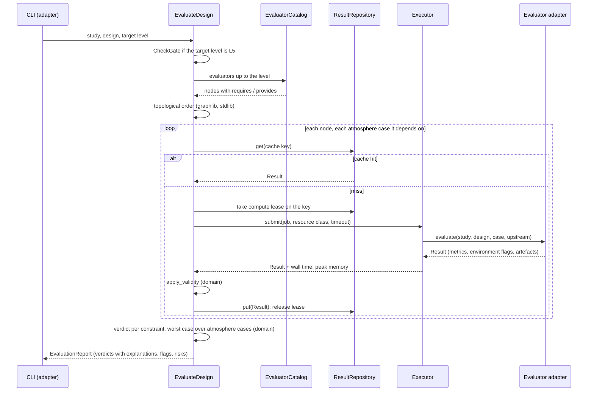

# jetsuite: architecture (v2, clean architecture)

**Status (2026-09-15): specification, nothing built yet.** Companion documents:
* `docs/suite_build_plan.md`: milestones, how to start, and the checklist for every development step;
* `docs/suite_coverage_review.md`: what analysis exists and what is missing (the external review, checked against
  the project data), with engineering checks E1-E3.

The suite changes no engineering result, freeze decision or open risk. The centrifugal baseline
(`ce75000_opr4_t1150_b15_cap`), `docs/design_freeze.md` and its open risks stand as they are. **When the architecture
needs to change, change this document first** (with a line in section 14), then the code.

---

## 1. What the suite is

`jetsuite` turns the phase-by-phase study of one engine into a design tool that:

1. takes a **study**: requirements (thrust, flight condition, atmosphere cases, airframe limits), a design space and a
   technology level;
2. **screens many designs cheaply and promotes only the survivors** to more expensive analysis (fidelity levels
   L0-L5), using gates tied to each level's measured error;
3. **keeps every number traceable** (inputs, code version, tool versions) and says where each tool is valid;
4. is **driven from Claude Code** through a CLI, skills, agents and hooks, **with the brief's human gates kept**.

**v1 scope:** the single-spool centrifugal turbojet, with the existing physics in `scripts/` wrapped rather than
rewritten.

**Not in v1:** new physics (except the evaluators listed in Appendix C, each behind its own verification), controls,
hardware validation, replacing the phase reports or `design_log.md`.

---

## 2. Architectural drivers

These are what the architecture has to protect. Every structural choice below traces back to one of them.

| # | driver | where it comes from | consequence |
|---|---|---|---|
| D1 | **no number without a source** | brief rule 1 | a number enters only as a `Metric` with a source; reports are rendered from the store only |
| D2 | **the tools are the volatile part**: about twenty defects found so far, patches, pinned git commits | `tools_survey.md` | tools sit in the outermost ring behind interfaces; the rules never import a tool |
| D3 | **three incompatible venvs** (NumPy 1 / NumPy 2 / CAD) | CLAUDE.md | the core is stdlib-only; cross-venv calls are subprocess + JSON |
| D4 | **expensive, memory-bound runs** (maps, 3D FE, 14 GB RAM) | README, tools_survey | an executor with resource classes; content-addressed caching |
| D5 | **human gates** (no CAD before the freeze sign-off; the user decides) | brief rule 4 | the gate policy is a domain rule; the application refuses L5 without a user gate record |
| D6 | **the committed results must reproduce** | CLAUDE.md reproduction targets | legacy physics is wrapped, not rewritten; golden tests guard it |
| D7 | **several agents at once** | this project's way of working | separate worktrees; locked, content-addressed store |
| D8 | **a learning project** | CLAUDE.md | every verdict carries its explanation ("fails because...") |

---

## 3. The clean architecture

### 3.1 The idea, and why it fits

Clean architecture (R. C. Martin, *Clean Architecture*, 2017) arranges code in concentric rings. The inner rings hold
what is **stable and valuable**; the outer rings hold what is **volatile and replaceable**. The one rule is the
**dependency rule: source-code imports point inward only.** An inner ring never names anything in an outer ring;
when it needs something from outside (a database, a solver), it defines an interface (a *port*), and the outer ring
supplies an *adapter* that implements it.

In this project the stable, valuable part is the **engineering rules**: how margins are judged against error bands,
which tool is valid where, what provenance a number needs, when a human must sign off. The volatile part is the
**tools**: TurboFlow needed a run-time patch, pyCycle needs special seeding, TurboDesigner has an inverted blockage
convention, and three venvs cannot share NumPy. With the dependency rule:
* the rules are testable in milliseconds, with no pyCycle and no TurboFlow;
* a tool can be replaced (TurboFlow by turbo-design, a new CFD code added) without touching the gates;
* the core runs in any of the three venvs, because it needs only the standard library.

### 3.2 The four rings

```
+--------------------------------------------------------------------------+
| 4  FRAMEWORKS AND DRIVERS                                                |
|    pyCycle/OpenMDAO  TurboFlow/CoolProp  turbo-design  scikit-fem  ROSS  |
|    CadQuery  gmsh  sqlite3  the three venvs  scripts/ (legacy physics)   |
|    Claude Code (skills, agents, hooks)  composition root  worker mains   |
|  +--------------------------------------------------------------------+  |
|  | 3  INTERFACE ADAPTERS                                              |  |
|  |    evaluator adapters (anti-corruption layer over scripts/)        |  |
|  |    SQLite repository  artefact store  subprocess executor          |  |
|  |    config loaders (YAML -> domain)  provenance probes              |  |
|  |    samplers  surrogates  optimisers  CLI  presenters  md writers   |  |
|  |  +--------------------------------------------------------------+  |  |
|  |  | 2  APPLICATION: use cases + ports (stdlib only)              |  |  |
|  |  |    CreateStudy  EvaluateDesign  Screen  Promote  Optimize    |  |  |
|  |  |    RunUQ  EstimateBands  Report  DraftLogEntry  CheckGate    |  |  |
|  |  |  +--------------------------------------------------------+  |  |  |
|  |  |  | 1  DOMAIN: entities + pure rules (stdlib only)         |  |  |  |
|  |  |  |    Study Design Variable Metric Constraint Result      |  |  |  |
|  |  |  |    Verdict ErrorBand ValidityRule Provenance Risk      |  |  |  |
|  |  |  |    gate rule  worst case  Pareto  band estimation  ids |  |  |  |
|  |  |  +--------------------------------------------------------+  |  |  |
|  |  +--------------------------------------------------------------+  |  |
|  +--------------------------------------------------------------------+  |
+--------------------------------------------------------------------------+
                     imports point inward only
```

| ring | package | may import | must not import |
|---|---|---|---|
| 1 domain | `jetsuite.domain` | Python standard library | anything else (no numpy, no pydantic, no tools, no `jetsuite.app` / `adapters`) |
| 2 application | `jetsuite.app` | `jetsuite.domain`, standard library | numpy, pydantic, tools, `jetsuite.adapters` |
| 3 adapters | `jetsuite.adapters` | `app`, `domain`, third-party libraries, `scripts/` (only through `adapters/legacy`) | nothing outward (drivers, worker mains) |
| 4 drivers | `jetsuite.main`, `jetsuite.workers`, `.claude/` | everything | - |
| shared protocol | `jetsuite.protocol` | standard library only | everything else; importable from all three venvs |

The rule is **enforced by a test** (`tests/architecture/test_dependency_rule.py`). It walks the AST of every module
and fails on an outward import, the same technique the repo split used to prove its import closure (design log F0.1).

---

## 4. Ring 1: domain

Pure data and pure functions. No I/O, no clocks, no randomness except through arguments.

### 4.1 Entities

| entity | key fields | invariants |
|---|---|---|
| `Metric` | name, value, unit, source (evaluator id or citation) | a metric without a source cannot be built |
| `Variable` | name, unit, kind (`free` with bounds / `fixed` / `derived`), status (`frozen` / `derived` / `provisional`), source | a free variable has min < max; a fixed one has a value and a source |
| `AtmosphereCase` | name, dT_K, source | the design case is `ISA` |
| `Requirements` | thrust, flight condition, MTOW, dash margin target, runway, atmosphere cases | all with sources |
| `TechLevel` | `tool` or `fielded`, efficiencies, losses, source | |
| `Installation` | intake model, jetpipe ΔPt/Pt, power extraction, bleed | statuses as for variables |
| `Study` | id, architecture, requirements, tech level, design space, installation, materials, objectives, constraints | id is unique; every constraint references a known metric |
| `Design` | id, study id, variable values | id = hash of study id + canonical variables; values inside bounds |
| `Level` | L0 ... L5 | ordered |
| `ConstraintSpec` | name, metric, sense (≤ / ≥), limit, kind (`gate` / `sized_to_limit` / `monitor_only`), first level where it can be evaluated, linked risk | |
| `ErrorBand` | quantity, level, value (relative or absolute), status (`cited` / `measured` / `unknown`), source | `unknown` bands make a gate constraint `uncertain`, never `pass` |
| `ValidityRule` | id, applies to (evaluator / tool), kind (`metric` predicate or `environment`), action (`flag` / `refuse` / `monitor_only`), linked risk, source | |
| `ValidityFlag` | rule id, message, linked risk | |
| `Provenance` | cache key, git SHA, dirty flag, source-content hashes, venv, tool versions, wall time, peak memory | complete, or the result is rejected |
| `Result` | design id, evaluator id + version, level, atmosphere case, tech level, metrics, flags, provenance, artefact paths, status (`ok` / `failed` + reason) | |
| `Verdict` | `pass` / `uncertain` / `fail` / `sized_to_limit` / `monitor_only` / `pending`, margin, band, binding case, **explanation** | |
| `GateRecord` | study, level, signed by, date, reference document | written by the user only (section 7.3) |
| `Risk` | id (e.g. `R4R.1`), text, status | open risks are never shown as closed |

### 4.2 Pure rules (domain services)

| function | rule |
|---|---|
| `design_id(study, values)` | SHA-256 of canonical JSON (sorted keys, fixed float formatting) |
| `normalised_margin(value, limit, sense)` | g = (limit − value) / \|limit\| for ≤, sign flipped for ≥; g ≥ 0 is feasible |
| `verdict(g, band, kind)` | `pass` if g ≥ b; `uncertain` if −b < g < b; `fail` if g ≤ −b; `sized_to_limit` and `monitor_only` pass through; `pending` if the constraint's first level is not reached |
| `worst_case(verdicts by atmosphere case)` | the worst verdict over the study's cases, naming the binding case |
| `promotion(verdicts, policy)` | promote if all pass; if budget allows, also those with some uncertain and no fail |
| `pareto(points, objectives, eps)` | non-dominated set with an ε-band taken from the error bands |
| `estimate_band(pairs, q)` | band = the q-quantile of the discrepancy between two levels (default q = 0.95) |
| `apply_validity(result, rules)` | evaluate the metric predicates; attach flags; a `refuse` rule marks the result unusable |

**Why the gate rule has this shape.** An optimiser drives designs onto constraint boundaries, where a cheap model's
error does the most damage. The baseline shows it: the exducer root is sized exactly at Fty and the turbine tip
exactly on its 350 MPa limit. Requiring a margin larger than the level's measured error keeps the loop from
promoting designs that are feasible only because the model is wrong. The `uncertain` class keeps the loop from
throwing away designs that might be feasible. **A quantity with no valid error band cannot gate:** the surge margin
from the peak-PR surrogate (real HECC margin 8.4 %, surrogate ≥ 73 %) is `monitor_only`, linked to R4R.1.

---

## 5. Ring 2: application

### 5.1 Ports (interfaces the application owns)

| port | responsibility | v1 adapter |
|---|---|---|
| `Evaluator` | `evaluate(study, design, case, upstream) -> Result`; declares id, version, level, venv, resource class, requires, provides, source files, whether it depends on the atmosphere case, validity rule ids | legacy centrifugal adapters (Appendix C) |
| `EvaluatorCatalog` | the evaluators of an architecture, up to a level | built from config |
| `ResultRepository` | `get(key)`, `put(result)`, `query(...)`, compute leases | SQLite |
| `ArtifactStore` | a directory per (study, design, evaluator, case) | filesystem |
| `Executor` | `submit(job) -> future`, resource classes, timeouts | subprocess executor (plus an in-process one for tests) |
| `ProvenanceProbe` | git SHA / dirty flag, source-content hashes of an import closure, tool versions, venv | git + lock files + AST closure |
| `Sampler` | `sample(space, n, seed)` | `scipy.stats.qmc` |
| `Surrogate` | `fit`, `predict` with uncertainty | chosen in M7 (after its add-tool check) |
| `Optimizer` | `propose(surrogate, constraints, budget)` | chosen in M7 |
| `GateRecordReader` | is level Lk signed for this study? | reads `suite/gates/` |
| `Presenter` | render a report: text, JSON, markdown, design-log draft | four presenters |
| `Clock` | now | system clock |

### 5.2 Use cases

| use case | input | output | what it does |
|---|---|---|---|
| `CreateStudy` | study YAML path | `Study` | loads through the config adapter, validates, stores |
| `EvaluateDesign` | study, design, target level | `EvaluationReport` | plans the evaluator DAG, runs or reuses each node, applies validity, computes verdicts (5.3) |
| `Screen` | study, level, n, seed | ranked designs | samples the space, evaluates at the level, filters to the ε-Pareto set |
| `Promote` | study, from-level, budget | promoted designs + gate report | applies `promotion` to every design at the level |
| `Optimize` | study, level, budget | candidates, each checked with the real model | surrogate-assisted search; **no surrogate pick is reported until the real evaluator has confirmed it** |
| `RunUQ` | study, design, input distributions | output distributions, P(constraint holds), input ranking | Monte Carlo on a surrogate, spot-checked with real runs (5.5) |
| `EstimateBands` | pairs of results at two levels | proposed bands | produces a **proposal** and a design-log draft; takes effect only after the user accepts it |
| `Report` / `DraftLogEntry` | study or result ids | markdown | rendered from the store only |
| `CheckGate` | study, level | allowed / refused + reason | L5 needs a user gate record |
| `Verify` | quick / full | pass / fail per check | runs the regression suites (build plan) |

### 5.3 EvaluateDesign, step by step



### 5.4 Cache key

SHA-256 of:
* evaluator id and version;
* canonical JSON of the inputs it reads: design variables, the study fields it declares, the atmosphere case;
* the cache keys of the upstream results it consumes;
* the content hashes of its source files **and of their repo-local import closure**;
* the tool versions from the venv lock file.

Content hashes (not git blobs) mean uncommitted edits invalidate the cache too. This replaces "delete the file to
force regeneration": a model change invalidates exactly the dependent results. Failed results are cached too, with a
retry switch.

### 5.5 Uncertainty quantification

* **Inputs:** distributions with a stated source each (rule 1). Candidates: component efficiencies (fielded spread,
  e.g. η_c 0.66-0.70), burner / duct / jetpipe losses, tip clearance, mass calibration (1.14-1.27), wave-drag level,
  combustor loading (theta log-σ 0.20), ambient temperature. A known range with no known distribution is sampled
  uniformly, and the report says so.
* **Method:** Latin-hypercube samples through a surrogate of the L1-L3 chain, with a subset re-run on the real
  evaluators to check the surrogate.
* **Outputs:** distributions of dash margin, TOGW and TSFC; P(each constraint holds); a variance-based ranking of the
  inputs. The ranking says which uncertainty is worth reducing by analysis or test.
* **Excluded:** the surge margin, and anything behind a `refuse` rule.
* **Kept apart from the error bands:** the bands say how wrong a *model* can be; the Monte Carlo says how much the
  *engine* can vary. Reports show both, side by side.

---

## 6. Ring 3: interface adapters

### 6.1 Evaluator adapters: the anti-corruption layer over `scripts/`

The legacy scripts are the physics library. Each adapter translates between the clean domain and one legacy entry
point. Adapter rules:
1. **Translate in, translate out.** Domain → legacy arguments / env vars / JSON; legacy output → `Metric`s with units
   and sources.
2. **Isolate state.** Where the legacy code mutates module globals or reads env vars (`at.OPR = opr`,
   `impeller_stress.set_geometry`, `P3_*`), the adapter runs it in a fresh subprocess. It never mutates globals in a
   long-lived process.
3. **Redirect every output.** Legacy scripts write into `data/` (e.g. `cc_trade` → `data/phase3r/cct_*.json`). The
   adapter points them at its artefact directory: `P3_DATA` already accepts an absolute path (design log F0.3). Where
   no such hook exists, the legacy script is parameterised with a default equal to today's behaviour. **A test asserts
   that `git status data/` is clean after a suite run.**
4. **Split only at clean seams.** Where the legacy chain has a clean seam (cycle → stress → mass → airframe), it
   becomes separate evaluators, which caches better. Where it is an iteration loop (`arch_trade.design_case`), it is
   wrapped as one coarse evaluator, so the algorithm is unchanged.
5. **Environment checks become flags.** Examples: TurboFlow slip patch active (V-TF-SLIP), pyCycle convergence
   residual, TurboFlow `success` flag ignored in favour of explicit constraint checks (V-TF-TURB).
6. **`scripts/` changes only by parameterisation**, with defaults equal to current values and the golden tests
   passing (build plan, checklist F).

All access to `scripts/` goes through `jetsuite.adapters.legacy`, which owns the `sys.path` handling. No other
module inserts paths.

### 6.2 Store

* `sqlite3` (standard library), WAL mode. Tables: `studies`, `designs`, `results`, `metrics`, `constraints`,
  `flags`, `leases`, `band_pairs`.
* The database file is `*.db`, which `.gitignore` already excludes. Artefacts go under `suite/runs/`, which gets a
  `.gitignore` entry.
* **Committed exports.** Following the repo convention that generated data is committed, each study's summary
  tables and the full records of every design that reached a gate are exported to `data/suite/<study>/`.
* **Compute leases.** A row per cache key with an owner and an expiry, so two agents asking for the same result
  compute it once.

### 6.3 Executor

* **v1: one subprocess per job**, using the project's existing file-in / file-out convention (`arch_trade.run_np1`
  generalised). The NumPy-1 side stays standalone: JSON in, JSON out, no imports from the `.venv` side.
* **Long-lived workers per venv** are an optimisation. They are added only if the M0 timings show interpreter or
  import start-up is a significant share of run time (ADR-0004).
* **Resource classes:**

  | class | used by | initial limit |
  |---|---|---|
  | `light` | L0, L1 | number of cores |
  | `turbo` | TurboFlow design calls | 12 (as in `cc_screen.py`) |
  | `map` | TurboFlow map speed lines / groups | **2** (MemoryError above that on 14 GB) |
  | `fe3d` | 3D FE (pypardiso) | 1 |
  | `cad` | CadQuery / gmsh | 1 |

  A memory watchdog holds new jobs above a threshold.
* **Failure policy.** A timeout per evaluator. Map groups re-run under their original part number. One TurboFlow
  speed line per process (a failed point poisons the rest of the call). pyCycle: seed off-design from the design
  point and restore the last converged state after a failed solve. `.venv-cad` is judged by its outputs, not its exit
  code (OCP teardown quirk). The executor sets `OPENMDAO_REPORTS=0`, and `ross_shim` is imported before ROSS.

### 6.4 Config loaders
YAML → pydantic DTOs (pydantic is installed in `.venv`) → domain entities. Validation errors name the file and the
field. Pydantic stays in this ring; the domain uses plain dataclasses.

### 6.5 Search adapters
`scipy.stats.qmc` samplers from M6. Surrogates and optimisers (candidates: OpenMDAO's surrogates and DOE drivers,
installed; SMT multi-fidelity kriging; pymoo NSGA-II) are chosen in M7, each after its add-tool check.

### 6.6 CLI and presenters
`click` (installed). Every command prints a short text summary (at most about 40 lines) and writes full JSON;
`--json` prints the machine form. That keeps Claude's context small. Presenters: text, JSON, markdown report,
design-log draft (`Dx.y` / `Fx.y` / `Rx.y` format: tool, inputs, outputs, why, with numbers).

| command | use case |
|---|---|
| `study new/show` | CreateStudy |
| `run <design or --baseline> --level Lk` | EvaluateDesign |
| `screen --level Lk --n N --seed S` | Screen |
| `promote --from Lk [--budget N]` | Promote |
| `optimize --level Lk --budget N` | Optimize |
| `uq <design>` | RunUQ |
| `bands propose` | EstimateBands |
| `results`, `compare`, `status` | queries |
| `report <study>`, `log-draft <id>` | Report, DraftLogEntry |
| `verify --quick / --full` | Verify |

---

## 7. Ring 4: frameworks and drivers

### 7.1 Composition root
`jetsuite.main.build_app(config)` is the only place that knows every concrete class: it wires adapters into the use
cases from `suite/config/suite.yaml`. Tests build the same app with fakes.

### 7.2 Run without installing into the frozen venvs
The analysis venvs are frozen (CLAUDE.md), so the suite is **not installed** into them in v1:
* pytest gets `pythonpath = ["src"]` from `suite/pyproject.toml`;
* the CLI runs through a shim, `.venv\Scripts\python suite\jetsuite.py <command>`, which puts `suite/src` on
  `sys.path` (the repo's usual pattern).

Everything v1 needs is already installed in `.venv`: pytest 9.1.1, pydantic 2.13.5, PyYAML 6.0.3, click 8.5.0,
networkx 3.6.1 (not needed: `graphlib` is stdlib), `sqlite3` (stdlib).

### 7.3 Claude Code integration

| piece | location | purpose |
|---|---|---|
| skills | `.claude/skills/<name>/SKILL.md` | `new-study`, `promote`, `verify-tools`, `log-decision`, `add-tool`, `explain-result` |
| agents | `.claude/agents/` | `verifier` (read-only: checks provenance, flags and bands before anything is reported; can block); `reviewer` (read-only: argues against a proposed decision using the numbers and the risk register) |
| permissions | `.claude/settings.json` | deny edits under `suite/gates/` and `suite/tests/golden/` |
| hooks | `.claude/settings.json` | PreToolUse: block Bash commands that write into `suite/gates/`. PostToolUse: after edits in `suite/` or `scripts/`, run the fast test gate and surface failures |
| MCP server | optional, after M5 | typed tools `evaluate`, `get_result`, `list_pareto`, `queue_status`, built only once the CLI is stable |

**Human gates.** L5 needs `suite/gates/L5_<study>.md`, written and committed by the user. The permission rules and
hooks are guard rails, not a guarantee: the real safeguard is the user's review. The exact permission and hook
syntax is checked against the Claude Code documentation when it is built (M5), not assumed.

**Several agents.** Each works in its own git worktree under its own study name. A shared store is safe because
cache keys include source-content hashes and writes take leases.

---

## 8. Fidelity levels

Levels are **cost classes**. Execution is a DAG of evaluators, because some dependencies cross levels: the L3
transient needs the rotor polar inertia from L4.

| level | purpose | cost per design | typical count |
|---|---|---|---|
| L0 feasibility | reject whole regions: closed-form cycle, database power laws, constraint diagram, tip-speed stress screen | ms (estimate) | 10⁴-10⁵ |
| L1 sizing | Pareto front: pyCycle dash cycle, meanline pre-sizing, impeller stress, combustor, mass, airframe | seconds (estimate) | 10²-10³ |
| L2 meanline design | tool-level efficiencies and geometry: cycle ↔ TurboFlow compressor ↔ TurboFlow turbine, turbo-design cross-check | minutes (estimate) | 20-50 |
| L3 off-design | maps, running lines, deck, sortie, transient, closure, installed thrust, every atmosphere case | tens of minutes to hours, memory-bound | 3-5 |
| L4 structures and dynamics | rotor, Campbell for all rows, bearings, clearances | minutes to tens of minutes (rotor ~7-15 min, measured) | 3-5 |
| L5 3D and high fidelity | CAD, 3D FE, CFD, reactor network | hours | 1, **user gate** |

Costs marked "estimate" become measurements in M0. Appendix C maps each level to its evaluators and their legacy
entry points.

**Manual Phase 4 decisions become variables.** The rotor fixes (liner ×0.8, 32 × 25.6 mm tube shaft, damped
supports) were engineering decisions taken by hand. In the suite they are L4 design variables with the API
separation as a constraint. The combustor length stays `provisional` and is flagged (V-COMB-1), because no tool
models combustion at that length (freeze open risk 4.3).

---

## 9. Physical layout

```
suite/                              the whole suite; nothing outside it changes in v1 except .claude/ and data/suite/
  pyproject.toml                    pytest config (pythonpath = src, markers); no install in v1
  README.md                         how to run
  jetsuite.py                       CLI shim
  BASELINE.md                       the commit the golden values were taken from
  src/jetsuite/
    domain/                         ring 1: entities.py, ids.py, gates.py, pareto.py, bands.py, validity.py
    app/                            ring 2: ports.py, dag.py, evaluate.py, screen.py, promote.py, optimize.py,
                                    uq.py, bands.py, report.py, gate.py, verify.py
    adapters/                       ring 3
      legacy/                       the only door into scripts/ (sys.path, subprocess, output redirection)
      evaluators/centrifugal/       L0 ... L5 evaluators
      store/                        sqlite_repository.py, artifacts.py
      executor/                     subprocess_executor.py, inprocess_executor.py (tests)
      provenance/                   git.py, closure.py, versions.py
      config/                       dto.py (pydantic), loader.py
      search/                       qmc.py (M6); surrogate / optimiser adapters (M7)
      cli/                          commands.py (click), presenters.py
    protocol.py                     stdlib-only job / result JSON schema, importable from all three venvs
    main.py                         composition root
    workers/                        subprocess entry points per venv (ring 4)
  config/                           suite.yaml, error_bands.yaml, validity.yaml
  studies/                          baseline_ce75000.yaml, ...
  gates/                            user-written sign-off records
  docs/adr/                         architecture decision records
  tests/
    unit/                           domain and app, with fakes
    architecture/                   dependency rule; "data/ untouched" check
    contract/                       each real adapter against its port, on a tiny case
    golden/                         reproduction of committed results (values read from committed data files)
    verification/                   the existing smoke_* / verify_* scripts with explicit tolerances
  runs/                             artefacts (gitignored)
.claude/                            skills/, agents/, settings.json
data/suite/<study>/                 committed exports
```

---

## 10. Cross-cutting concerns

### 10.1 Testing

| suite | pytest marker | covers | time budget | runs |
|---|---|---|---|---|
| unit | (none) | domain rules; use cases with fake evaluators and an in-memory repository | < 10 s | every step |
| architecture | (none) | dependency rule; no writes to `data/` | < 5 s | every step |
| contract | `contract` | each real adapter satisfies its port on a tiny case | < 2 min | steps that touch adapters |
| golden | `golden` | the wrapped chain reproduces committed results | minutes | steps that touch adapters or `scripts/` |
| verification | `verification` | tools against closed-form / published results | quick subset < 2 min; full measured in M0 | milestone close; tool changes |
| slow | `slow` | L3 and above | up to hours | milestone close |

* **Fast gate** = unit + architecture.
* **Quick verify** = fast gate + contract + golden subset + quick verification.
* **Full** = everything.

### 10.2 Errors
Evaluators never raise out of `evaluate`: a failure is a `Result(status="failed", reason=...)`, cached and reported.
Configuration errors fail loudly at load time. Domain invariants raise at construction.

### 10.3 Reproducibility
Seeds are explicit for every sampler and optimiser. Canonical JSON for ids and keys. `BASELINE.md` pins the golden
commit.

### 10.4 Logging
Each job logs to its artefact directory. The CLI prints summaries only.

---

## 11. Architecture decision records

Each is written as `suite/docs/adr/NNNN-title.md` (context, decision, alternatives, consequences) in M0.

| ADR | decision |
|---|---|
| 0001 | clean architecture; stdlib-only domain and application rings; dependency rule enforced by a test |
| 0002 | wrap the legacy physics in `scripts/` behind evaluator adapters; no rewrite in v1 |
| 0003 | `sqlite3` result store + filesystem artefacts; database not committed; per-study exports committed |
| 0004 | cross-venv execution by subprocess with the file-in / file-out convention; long-lived workers only if M0 timings justify them |
| 0005 | content-addressed cache over the source-content import closure |
| 0006 | gate rule: margin against the error band, worst atmosphere case, `monitor_only` for quantities with no band |
| 0007 | no installation into the frozen venvs; pytest `pythonpath` and a CLI shim |
| 0008 | build in a separate git worktree; the three venvs linked in as directory junctions |

---

## 12. Architecture risks

| risk | mitigation |
|---|---|
| the optimiser exploits model error | error-band gates; validity rules; every surrogate pick confirmed by the real model |
| wrapping changes numbers silently | golden tests before any adapter work (M0) |
| legacy scripts write into `data/` and overwrite committed results | output redirection in every adapter; the "data/ untouched" architecture test |
| legacy globals and env vars leak between evaluations | fresh subprocess per legacy call |
| automation weakens "no guessing" | metrics need a source; reports are rendered from the store only |
| surrogate extrapolation | restrict to the trained region; flag outside it |
| the core grows a dependency by accident | dependency-rule test |
| collisions with other agents | worktrees, leases, content-addressed results |
| CFD swallows the project | L5 additions start one at a time, on the user's choice |
| machine limits (14 GB) | resource classes, memory watchdog, measured costs |

---

## 13. Open decisions (for the user)

Defaults are proposed so that M0 can start; each can be changed later through an ADR.

| # | decision | proposed default |
|---|---|---|
| 1 | package name and location | `suite/`, package `jetsuite` |
| 2 | where the shared result store lives; what is committed | per worktree `suite/.store/` (gitignored); exports to `data/suite/` committed |
| 3 | objectives: TOGW, pessimistic dash margin, TSFC, engine OD; does robustness (P(margin ≥ 25 %)) enter the objective? | min TOGW, max worst-case pessimistic dash margin |
| 4 | a separate closed-form L0, or start at pyCycle L1 | decide from the M0 timings |
| 5 | first high-fidelity addition: diffuser-stall / RANS or the combustor reactor network | after E1-E3 (coverage review) |
| 6 | CLI only, or also an MCP server | CLI only until M5 is done |
| 7 | suite work proceeds while the freeze decisions stay open | yes; the suite does not change the baseline |
| 8 | hot-day case: ISA+20 (Phase 1 envelope E4) or ISA+25 (review) | ISA+20, ISA−15 |

---

## 14. Change record

| date | change |
|---|---|
| 2026-09-15 | v1: first specification |
| 2026-09-15 | v1.1: external review checked against the project data |
| 2026-09-15 | **v2: restructured as a clean architecture** (rings, ports, dependency rule, ADRs). The review moved to `docs/suite_coverage_review.md`; milestones and checklists moved to `docs/suite_build_plan.md` |

---

## Appendix A. Initial error bands

Sources are in the design log and `tools_survey.md`. They are loaded from `suite/config/error_bands.yaml`.

| quantity | level | band | status | source |
|---|---|---|---|---|
| compressor η_tt (same geometry) | L2 | ±1.5 points (TurboFlow 0.817 vs turbo-design 0.803) | cited | `td_check.py`; freeze 1.2 |
| compressor PR (same geometry) | L2 | ±1 % between tools; turbo-design vs NASA HECC measured +2.0 % | cited | `td_check.py`; `smoke_turbodesign.py` |
| choke flow (turbo-design) | L2 | +7 to +11 % | cited (upstream) | tools_survey s.1 |
| T4 / γ / cp (pyCycle vs Cantera) | L1 | −0.35 % / +0.0002 / +0.6 % | cited | freeze 1.1 |
| engine dry mass | L1-L2 | calibration 1.14-1.27 around 1.20 | cited | `data/phase3_mass_model_validation_3r.csv` |
| engine diameter | L1-L2 | +5.7 % (AMT Nike over-prediction) | cited | freeze 2 |
| axisymmetric disc FE | L1 | ≤ 0.5 % vs Timoshenko & Goodier | cited | `verify_axisym_fe.py` |
| rotor critical speeds (solver only) | L4 | 0.0001-0.20 %; the rotor-idealisation error is not covered | cited | `rotordynamics_verify.py` |
| exducer plate modes | L4 | −1.5 % vs clamped strip; static, conservative-low | cited | `cc_blade_modes.py` |
| idle speed | L3 | ~5 points of speed pessimistic (JetCat P400) | cited | `cc_benchmark.py` |
| **surge margin (peak-PR surrogate)** | L3 | **none**: HECC real 8.4 %, surrogate ≥ 73 % | invalid → `monitor_only` | `hecc_surge_check.py`, R4R.1 |
| every L0 → L1 and L1 → L2 discrepancy | L0, L1 | - | **unknown until M6** | measured on a common sample |

## Appendix B. Validity rules

Loaded from `suite/config/validity.yaml`. "Environment" rules are checked by the adapter; "metric" rules by the
domain.

| id | applies to | kind | rule | action | risk / source |
|---|---|---|---|---|---|
| V-TF-SLIP | TurboFlow centrifugal | environment | `turboflow_fixes` active (slip assertion of `verify_turboflow_slip.py`) | refuse | tools_survey s.8 |
| V-TF-MREL | TurboFlow Oh loss set | metric | inducer M1s,rel ≤ 1.33 | flag | `inducer_anchor.py` |
| V-TF-DIFF | TurboFlow vaned-diffuser loss | environment | R4/R2 may not be a free variable at L2 | refuse | tools_survey s.8 |
| V-TF-THROAT | TurboFlow `area_throat_ratio` | environment | carry the 10 % choke margin to the fielded impeller, not the ratio | refuse misuse | tools_survey s.9 |
| V-TF-TURB | TurboFlow turbine optimisation | environment | check constraints directly; ignore `success` | enforced | tools_survey s.8 |
| V-TF-GAS | TurboFlow turbine | environment | CoolProp air (γ ≈ 1.34) instead of products (1.313) | flag | `turbine_design.py` |
| V-SURGE | peak-PR surge surrogate | metric | invalid for vaned-diffuser stages | monitor_only | R4R.1 |
| V-PYC-OD | pyCycle off-design | environment | seed from design, march, restore after a failed solve | enforced | tools_survey s.9 |
| V-PYC-T4 | pyCycle T4 mode with TurboFlow maps | environment | use N mode + secant on speed | enforced | tools_survey s.8 |
| V-MAP-105 | compressor maps | metric | no data above 105 % corrected speed | flag | freeze 4.6 |
| V-TD-CC | turbo-design centrifugal | environment | `x_le` inside the path; throat from `area_throat_ratio` | refuse misuse | CLAUDE.md |
| V-TDR-BLK | TurboDesigner | environment | blockage 0.02 / 0.04, never 0.98 / 0.96 | schema check | F4.2 |
| V-AX-STACK | own axial stacking model | environment | unvalidated at micro scale | flag every result | R4.1 |
| V-COMB-1 | combustor sizing (theta) | metric | liner < 3 × annulus height | flag | freeze 4.3 |
| V-MODE-STAT | exducer plate modes | environment | static frequencies; no forced response | flag | freeze 4.4 |
| V-INST | installed thrust | metric | jetpipe loss or power extraction still `provisional` | flag | coverage review |
| V-HW | everything | environment | no hardware validation of this design | always on | freeze 4.5 |

## Appendix C. Evaluator catalogue (centrifugal plugin)

Evaluator ids are `cc.<level>.<name>`. "Existing" means a legacy entry point is wrapped; "new" means new code
behind its own verification.

| id | level | wraps | venv | resource | per atmosphere case | status |
|---|---|---|---|---|---|---|
| `cc.L0.cycle_closed_form` | L0 | new: ideal Brayton with the study's efficiencies | any | light | yes | new (M6) |
| `cc.L0.envelope_fit` | L0 | `engine_database_fit.py` power laws | .venv | light | no | existing |
| `cc.L0.tip_stress` | L0 | (3+ν)/8 ρU² screen (as `arch_trade.py:186`) | any | light | no | existing relation |
| `cc.L1.cycle` | L1 | `dash_cycle.design` | .venv | light | design case | existing |
| `cc.L1.presize` | L1 | pre-sizing extracted from `centrifugal_design.py` (inducer optimum, Euler + Wiesner) | .venv | light | no | new (M6); check its CoolProp dependence |
| `cc.L1.impeller_stress` | L1 | `impeller_stress.evaluate` | .venv | light | no | existing (fresh process: globals) |
| `cc.L1.combustor` | L1 | `combustor_sizing.combustor` | .venv | light | no | existing |
| `cc.L1.mass` | L1 | `engine_mass.engine` + calibration | .venv | light | no | existing |
| `cc.L1.airframe` | L1 | `arch_trade.airframe`, parameterised | .venv | light | design case | existing, parameterise constants |
| `cc.L2.meanline` | L2 | `arch_trade.design_case` + `cc_trade.evaluate_all` (coarse: it is an iteration loop) | .venv + .venv-np1 | turbo | design case | existing |
| `cc.L2.td_check` | L2 | `td_check.py` | .venv | turbo | no | existing |
| `cc.L2.clearance_sweep` | L2 | TurboFlow at several clearances | .venv-np1 | turbo | no | new |
| `cc.L3.maps` | L3 | `run_centrifugal_map.sh`, `run_turbine_map.sh` (Python driver) | .venv-np1 | map | no | existing |
| `cc.L3.deck` | L3 | `cc_mission.py` (running lines, deck, sortie) | .venv | light | yes | existing, add dT and output redirection |
| `cc.L3.installed` | L3 | jetpipe loss and power extraction in the cycle | .venv | light | yes | new (from E1) |
| `cc.L3.transient` | L3 | `cc_transient.py` (needs I_p from `cc.L4.rotor`) | .venv | light | yes | existing |
| `cc.L3.windmill_relight` | L3 | windmill and relight envelope | .venv | light | yes | new |
| `cc.L3.decel` | L3 | deceleration and flameout margin | .venv | light | yes | new |
| `cc.L3.closure` | L3 | `cc_closure.py` | .venv | light | design case | existing |
| `cc.L4.rotor` | L4 | `cc_rotor.py`, `cc_rotor_final.py` | .venv | light | no | existing |
| `cc.L4.campbell` | L4 | `cc_blade_modes.py` + diffuser vanes, NGVs, turbine blades | .venv | light | no | partly new (from E2) |
| `cc.L4.bearings` | L4 | bearing heat, lubrication, temperatures | .venv | light | yes | new (from E3) |
| `cc.L4.unbalance` | L4 | unbalance response (ROSS) | .venv | light | no | new |
| `cc.L5.cad` | L5 | `make_params.py`, `impeller_cad.py`, `engine_cad.py`, `airframe_cad.py` | .venv + .venv-cad | cad | no | existing |
| `cc.L5.fe3d` | L5 | `fe3d_impeller.py` | .venv-cad | fe3d | no | existing |
| `cc.L5.cfd`, `cc.L5.reactor_net`, `cc.L5.calculix` | L5 | high-fidelity additions (coverage review) | tbd | tbd | tbd | new, each after an add-tool check |
