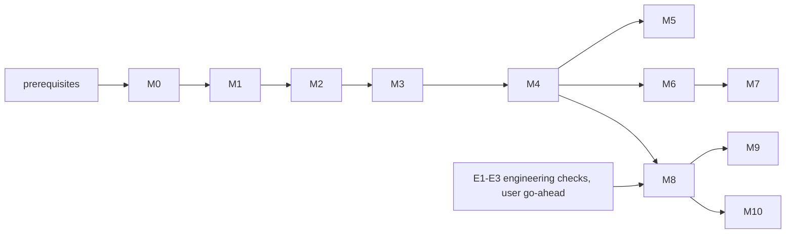

# jetsuite: build plan, milestones and development checklists

**Status (2026-09-15): nothing built yet.** This plan builds the architecture in `docs/suite_architecture.md`
(referred to below as "arch §n"). Engineering gaps and checks E1-E3 are in `docs/suite_coverage_review.md`.

**How to use this document:**
* Work one **step** at a time. A step is one unticked task box below, small enough for one commit.
* Every step follows the loop in section 4 and ends with the Definition of Done (section 4.3).
* Tick a box only with evidence: the command you ran and the file or output that shows it. Record it in the
  progress log (section 8).
* If a step shows the architecture is wrong, stop, change `docs/suite_architecture.md` first (arch §14), then continue.

---

## 1. Build strategy in one paragraph

Build **inside-out and behind a safety net**:
1. **M0:** golden tests that pin today's committed results, so nothing that follows can silently change a number.
2. **M1, M2:** the pure core (domain and application), tested with fake evaluators. This gives a *walking skeleton*:
   the whole flow from study to promotion report runs end to end in seconds, with no physics.
3. **M3, M4:** swap in the real store, executor and legacy-physics adapters one port at a time. After each swap, the
   same tests must still pass.
4. **M5 onward:** grow the CLI, Claude Code integration, levels and search.

The order is chosen for a reason. The rules are where mistakes are cheapest to find (milliseconds, no solvers). The
legacy physics is where mistakes are most expensive (minutes to hours, memory limits).

---

## 2. Prerequisites (before the first step)

- [ ] **The repository-split commit has landed.** The other agent has ~323 files staged (the axial quarantine). The
      suite must branch from a commit that contains it, and its SHA becomes the golden baseline.
- [ ] The three venvs work in the main checkout (`smoke_pycycle.py`, `smoke_turboflow.py`, `smoke_cad.py`).
- [ ] Open decisions with a proposed default (arch §13) are accepted or changed by the user. M0 needs only #1 (name
      and location); the rest can wait for their milestone.
- [ ] The user has decided whether engineering checks E1-E3 run in parallel. They are not needed until M8.

---

## 3. How to start: day one

PowerShell, from the main checkout (`boomsonic_v0`).

### 3.1 Record the baseline and create the worktree

```powershell
git log -1 --format="%H %cd"                        # the baseline commit, written into suite/BASELINE.md below
git worktree add ..\boomsonic_suite -b suite/m0-foundations
```

The venvs are gitignored, so the worktree has none. The legacy scripts find `.venv-np1` relative to their own repo
root, so the worktree needs them. Link the three venvs in as directory junctions (ADR-0008):

```powershell
foreach ($v in ".venv", ".venv-np1", ".venv-cad") {
    New-Item -ItemType Junction -Path "..\boomsonic_suite\$v" -Target (Resolve-Path $v)
}
```

**Caution:** the venvs are shared through the junctions. Never `uv pip install` from the worktree without following
checklist C (refreeze the requirements file, log it).

Check that the links work:

```powershell
cd ..\boomsonic_suite
.venv\Scripts\python scripts\phase0_tools\smoke_pycycle.py
.venv-np1\Scripts\python -c "import turboflow; print('np1 ok')"
.venv-cad\Scripts\python -c "import cadquery; print('cad ok')"     # judge by the output, not the exit code
```

### 3.2 Create the skeleton

Directories from arch §9:

```powershell
$d = "suite/src/jetsuite/domain", "suite/src/jetsuite/app", "suite/src/jetsuite/adapters/legacy",
     "suite/src/jetsuite/adapters/evaluators/centrifugal", "suite/src/jetsuite/adapters/store",
     "suite/src/jetsuite/adapters/executor", "suite/src/jetsuite/adapters/provenance",
     "suite/src/jetsuite/adapters/config", "suite/src/jetsuite/adapters/search", "suite/src/jetsuite/adapters/cli",
     "suite/src/jetsuite/workers", "suite/config", "suite/studies", "suite/gates", "suite/docs/adr",
     "suite/tests/unit", "suite/tests/architecture", "suite/tests/contract", "suite/tests/golden",
     "suite/tests/verification"
$d | ForEach-Object { New-Item -ItemType Directory -Force $_ | Out-Null }
```

Add an empty `__init__.py` to every package directory under `src/jetsuite/`.

Append to `.gitignore`:

```
suite/runs/
suite/.store/
```

`suite/pyproject.toml`. No install; pytest runs from `src` (ADR-0007):

```toml
[project]
name = "jetsuite"
version = "0.0.1"
requires-python = ">=3.12"

[tool.pytest.ini_options]
pythonpath = ["src"]
testpaths = ["tests"]
markers = [
    "contract: a real adapter against its port on a tiny case",
    "golden: reproduction of committed results",
    "verification: a tool against closed-form or published results",
    "slow: L3 and above",
]
```

`suite/jetsuite.py`, the CLI shim. It fails cleanly until M5 provides `main`:

```python
"""jetsuite CLI shim: puts suite/src on sys.path (no install into the frozen venvs, ADR-0007)."""
import pathlib, sys
sys.path.insert(0, str(pathlib.Path(__file__).resolve().parent / "src"))
from jetsuite.main import cli    # M5
cli()
```

### 3.3 The first three tests

**(a) The dependency rule** (`suite/tests/architecture/test_dependency_rule.py`), arch §3.2:

```python
"""Imports point inward only. domain: stdlib; app: stdlib + domain; protocol: stdlib."""
import ast, pathlib, sys
SRC = pathlib.Path(__file__).resolve().parents[2] / "src" / "jetsuite"
ALLOWED = {"domain": {"jetsuite.domain"}, "app": {"jetsuite.domain", "jetsuite.app"}, "protocol.py": set()}

def imported(path):
    pkg = path.relative_to(SRC.parent).with_suffix("").parts[:-1]     # e.g. ('jetsuite', 'domain')
    for node in ast.walk(ast.parse(path.read_text(encoding="utf-8"))):
        if isinstance(node, ast.Import):
            yield from (a.name for a in node.names)
        elif isinstance(node, ast.ImportFrom):
            if node.level == 0:
                yield node.module
            else:                                                    # resolve relative imports: '..app' must not escape
                base = pkg[:len(pkg) - (node.level - 1)]
                yield ".".join(base + ((node.module,) if node.module else ()))

def violations(ring):
    target = SRC / ring
    files = [target] if target.is_file() else sorted(target.rglob("*.py"))
    for f in files:
        for mod in imported(f):
            top = mod.split(".")[0]
            if top in sys.stdlib_module_names: continue
            if any(mod == a or mod.startswith(a + ".") for a in ALLOWED[ring]): continue
            yield f"{f.relative_to(SRC)} imports {mod}"

def test_inner_rings_import_inward_only():
    bad = [v for ring in ALLOWED if (SRC / ring).exists() for v in violations(ring)]
    assert not bad, "\n".join(bad)
```

Test the test: add `import numpy` to a domain file, confirm the test fails, then remove it.

**(b) Golden G1: the fielded dash cycle** (`suite/tests/golden/test_g1_dash_cycle.py`). This is the CLAUDE.md
reproduction target (W 1.32575 kg/s, TSFC 0.16416). The expected values are **read from the committed file**, never
typed:

```python
import csv, pathlib, sys, pytest
ROOT = pathlib.Path(__file__).resolve().parents[3]

@pytest.mark.golden
def test_fielded_dash_cycle_reproduces_phase3():
    rows = csv.DictReader(open(ROOT / "data" / "phase3_cycle_trade.csv", newline=""))
    ref = next(r for r in rows if r["level"].startswith("fielded") and r["nozzle"] == "CV"
               and float(r["T4"]) == 1150.0 and float(r["OPR"]) == 4.0)
    sys.path.insert(0, str(ROOT / "scripts" / "phase3_cycle"))     # tests are ring 4; adapters will own this later
    import dash_cycle as dc
    cyc, _ = dc.design(4.0, 1150.0, 0.70, 0.75)
    assert cyc["W_kgps"] == pytest.approx(float(ref["W"]), rel=1e-5)
    assert cyc["TSFC_kgpNh"] == pytest.approx(float(ref["TSFC"]), rel=1e-5)
```

If it fails, **stop**. That is a finding about the baseline, not a tolerance to loosen.

**(c) A domain smoke test** (`suite/tests/unit/test_smoke.py`): `import jetsuite.domain` works.

Run:

```powershell
.venv\Scripts\python -m pytest suite -m "not contract and not golden and not verification and not slow"   # fast gate
.venv\Scripts\python -m pytest suite -m golden
```

### 3.4 Close day one
- [ ] `suite/BASELINE.md` has the commit SHA and date, and lists the golden sources (the files the expected values
      are read from).
- [ ] ADR-0001 (clean architecture) written from the template in section 6.
- [ ] Commit: `Suite M0: skeleton, dependency-rule test, golden G1`.

---

## 4. The checklist for every development step

### 4.1 Definition of Ready (before starting a step)
- [ ] The step is **one** unticked task box in section 7.
- [ ] I know which ring the change lives in (arch §3.2), and that it doesn't pull an import outward.
- [ ] I know which test will prove it, and the test can be written before the code.
- [ ] No open decision (arch §13) blocks it.
- [ ] I am in the suite worktree on a `suite/...` branch, and the fast gate is green before I start.

### 4.2 The step loop
1. **Write or extend the test first.** For a domain rule, a table of cases. For an adapter, the port's contract test.
2. **Write the smallest change** that makes it pass.
3. **Run the fast gate** (unit + architecture, < 15 s).
4. **Touched an adapter or `scripts/`?** Run contract + golden (quick verify).
5. **Touched a tool, a tolerance or a band?** Run the relevant verification tests too.
6. **Check `git status data/`:** it must be clean (arch §6.1 rule 3).
7. **Update the docs.** An architecture change goes into the architecture doc + its change record; a decision gets an
   ADR; a new command goes into `suite/README.md`.
8. **Engineering numbers.** If any engineering number changed or is new, write a `design_log.md` **draft** for the
   user. Nothing goes into the log unreviewed.
9. **Commit:** `Suite Mk: <what changed>`.
10. **Tick the box** and add the evidence to the progress log (section 8).

### 4.3 Definition of Done (per step)
- [ ] The test was written before the code, and it passes.
- [ ] Fast gate green; dependency-rule test green.
- [ ] Contract and golden tests green, if an adapter or `scripts/` was touched.
- [ ] `git status data/` clean; no stray files outside `suite/`, `.claude/`, `data/suite/`.
- [ ] No new dependency; or checklist C completed.
- [ ] Every new number has a source (a `Metric` with a source, or a citation in config).
- [ ] No open risk presented as resolved; validity flags still attached where they apply.
- [ ] Docs, ADR and README updated as needed; a design-log draft exists if engineering numbers moved.
- [ ] Committed with the `Suite Mk:` prefix; box ticked with evidence.

### 4.4 Checklists for specific kinds of step

**A. Adding or changing a domain rule** (ring 1)
- [ ] A table-driven unit test with edge cases: zero margin, a band of zero, an `unknown` band, every verdict kind.
- [ ] Standard library only (the dependency-rule test proves it).
- [ ] Pure: no I/O, clock or randomness except through arguments.
- [ ] The rule produces an explanation string, and a test checks that it names the constraint, value, limit, band and
      case.
- [ ] If it changes gate behaviour: ADR-0006 updated.

**B. Adding an evaluator adapter** (ring 3)
- [ ] An Appendix C row exists (id, level, wrapped entry point, venv, resource class, per-case flag). Add the row
      first if it is missing.
- [ ] It declares `requires`, `provides`, `sources` and `validity`.
- [ ] Legacy output goes to the artefact directory; `git status data/` is clean after a real run.
- [ ] The legacy call runs in a fresh subprocess if it touches globals or env vars.
- [ ] Every output is a `Metric` with a unit and a source.
- [ ] Environment validity checks are implemented as flags.
- [ ] Contract test: the port's behaviour on a tiny real case, including a forced failure that comes back as a failed
      `Result`, not an exception.
- [ ] Golden test: it reproduces the committed result the legacy script produced.
- [ ] Wall time and peak memory measured and put into arch §8.

**C. Adding a third-party tool** (a mini Phase 0; brief rule 3)
- [ ] The candidate identified exactly: name, version, source. Watch for name collisions (PyPI `pycycle` and
      `pyturbo` are unrelated packages).
- [ ] Installed in the right venv with `uv pip`; the `requirements-*.txt` refrozen; nothing else in that venv changed
      (diff the freeze).
- [ ] A smoke test against a closed-form or published result, with its error recorded.
- [ ] Its defects and limits written as validity rules (Appendix B) and in `tools_survey.md`.
- [ ] Its error band added (Appendix A) with status `cited` or `measured`.
- [ ] A `design_log.md` draft: tool, inputs, outputs, why it was chosen over the alternatives.
- [ ] Used only through an adapter behind a port.

**D. Adding a validity rule**
- [ ] It has an id, the tool it applies to, a kind (metric / environment), an action and a source (design-log entry or
      tools_survey section).
- [ ] Linked to a risk id if one applies.
- [ ] A test triggers it and a test shows it silent on a valid case.
- [ ] `refuse` rules: a test shows the evaluator will not run.

**E. Changing an error band**
- [ ] The change comes from `EstimateBands` (measured pairs) or from a new cited source, never from convenience.
- [ ] A design-log draft with the old value, the new value, the evidence and the number of pairs.
- [ ] **The user accepts it before it takes effect** (arch §5.2).
- [ ] Re-run the gates of every study that has results at the affected level, and report what changed.

**F. Touching a legacy script under `scripts/`**
- [ ] The only allowed change is **parameterisation**: a new argument, env var or output-path hook whose default
      equals today's behaviour.
- [ ] The golden tests and the script's own verification pass unchanged.
- [ ] The script still runs standalone exactly as documented in `README.md`.
- [ ] NumPy-1 scripts stay standalone (file in, file out; no imports from the `.venv` side).
- [ ] A line in the step's commit message says which script changed and why.
- [ ] Mention it to the user: other agents work on `scripts/` too.

**G. Changing the store schema**
- [ ] A migration step (version table) and a test that migrates an old database.
- [ ] Cache keys unaffected, or bumped deliberately with an ADR.
- [ ] The in-memory and SQLite repositories pass the same contract tests.

**H. Adding a CLI command or a Claude Code skill**
- [ ] It maps to exactly one use case (arch §6.6).
- [ ] Output is at most about 40 lines of text, and full JSON with `--json`.
- [ ] A skill states what it must never do: tick gates, edit golden files, append to `design_log.md` without review.
- [ ] Documented in `suite/README.md`.

**I. Closing a milestone**
- [ ] Every task box ticked with evidence.
- [ ] Full test run: fast + contract + golden + verification (+ slow if the milestone touched L3 and above). The run
      time is recorded.
- [ ] `docs/suite_architecture.md` matches what was built (or its change record says where it differs).
- [ ] The progress log is updated; the milestone branch is merged or rebased as the user decides.
- [ ] A short summary for the user: what now works, what does not, what the next milestone needs from them.

---

## 5. Milestones

| id | goal | depends on | exit criterion | size |
|---|---|---|---|---|
| **M0** | foundations and safety net | prerequisites | golden G1, G2 and quick verification green in the worktree; timings measured | M |
| **M1** | domain core (ring 1) | M0 | every domain rule tested; worked examples from the freeze pass | M |
| **M2** | application core with fakes (walking skeleton) | M1 | study → evaluation → promotion report end to end with fakes, < 10 s | M |
| **M3** | infrastructure adapters | M2 | SQLite, executor, provenance and config pass the same contracts as the fakes | M |
| **M4** | legacy adapters L1-L2 + baseline study | M3 | `EvaluateDesign(baseline, L2)` reproduces G1 / G2 through the suite; `data/` untouched | L |
| **M5** | CLI + Claude Code integration | M4 | Claude takes a study to a promotion report with no manual script call | M |
| **M6** | L0, measured bands, real screening | M4 | bands measured on ≥ 30 designs and accepted by the user; `screen` + `promote` run on the real chain | L |
| **M7** | search and uncertainty | M6 | rediscovery test; UQ on the baseline with sourced inputs | L |
| **M8** | L3-L4 in the pipeline | M4 + E1-E3 results | hot / cold / ISA gates on the real deck; closure and rotor goldens reproduce | L |
| **M9** | L5 and high-fidelity additions | M8 + user gate | L5 refused without a gate record; each addition passed checklist C | L per addition |
| **M10** | architecture plugins, shared-module clean-up | M8 | the axial plugin works under `axial/`; old import paths still resolve | M |



Sizes are relative (S / M / L), not time estimates. M0's timings will make them concrete.

---

## 6. ADR template

`suite/docs/adr/NNNN-short-title.md`:

```markdown
# NNNN. Title
Date: YYYY-MM-DD. Status: proposed | accepted | superseded by NNNN
## Context        what forces the decision (link the architecture driver D1-D8)
## Decision       what we do
## Alternatives   what else was considered, and why not (with numbers where there are any)
## Consequences   what gets easier, what gets harder, what to watch
```

---

## 7. Milestone task lists

Each box is one step. The "evidence" column is what ticks it.

### M0: foundations and safety net

| ✓ | step | evidence |
|---|---|---|
| [ ] | 0.1 baseline recorded in `suite/BASELINE.md` (SHA, date, golden source files) | file |
| [ ] | 0.2 worktree + venv junctions; the three import checks of 3.1 pass | command output |
| [ ] | 0.3 skeleton, `pyproject.toml`, shim, `.gitignore` entries, `suite/README.md` | tree listing |
| [ ] | 0.4 dependency-rule test green; shown to fail on a deliberate bad import | two test runs |
| [ ] | 0.5 golden G1 (fielded dash cycle vs `data/phase3_cycle_trade.csv`) | test run |
| [ ] | 0.6 golden G2: `cc_trade.py reeval` of the baseline with `P3_DATA` pointed at a temp dir reproduces `data/phase3r/cct_ce75000_opr4_t1150_b15_cap.json` (fielded D, mass, margins, TOGW, worst corner). **Tolerance measured**: run twice, take the spread, set the tolerance above it, and write it into the test | test run + tolerance note |
| [ ] | 0.7 "data/ untouched" architecture test (fails if a test run leaves `git status data/` dirty) | test run |
| [ ] | 0.8 verification wrappers, quick set: `verify_axisym_fe`, `rotordynamics_verify`, `impeller_stress` (regression vs the gate), `verify_turboflow_slip` (np1), `verify_aero_tools`, `smoke_cantera`. Tolerances from the design-log numbers. Scripts that regenerate committed files are checked by "regenerated == committed", which doubles as a reproducibility check | test run |
| [ ] | 0.9 verification wrappers, full set: the rest of the CLAUDE.md commands list (`smoke_*`, `validate_mass_model` 3R, `cc_benchmark`, `hecc_surge_check`, `td_check`, `smoke_cad`, `fe3d_impeller A,B,BT`) | test run + run time |
| [ ] | 0.10 timing: wall time and peak memory of every "existing" Appendix C entry point; arch §8 updated from estimates | table in arch §8 |
| [ ] | 0.11 ADRs 0001-0008 written | files |
| [ ] | 0.12 milestone close (checklist I) | summary to user |

### M1: domain core (ring 1, stdlib only)

| ✓ | step | evidence |
|---|---|---|
| [ ] | 1.1 `Metric`, `Variable`, `AtmosphereCase` with invariants (a metric without a source cannot be built) | unit tests |
| [ ] | 1.2 `Requirements`, `TechLevel`, `Installation`, `Study`, `Design`, `Level` | unit tests |
| [ ] | 1.3 `design_id`: canonical JSON; stable across key order, float formatting and process runs | unit tests |
| [ ] | 1.4 `ConstraintSpec`, `normalised_margin`, `verdict` (all six verdict kinds; `unknown` band never gives `pass`) | table test |
| [ ] | 1.5 `worst_case` over atmosphere cases, naming the binding case | unit tests |
| [ ] | 1.6 `promotion` policy (all pass; uncertain allowed only within budget) | unit tests |
| [ ] | 1.7 `pareto` with an ε-band | hand-worked examples |
| [ ] | 1.8 `estimate_band` from pairs (quantile) | unit tests |
| [ ] | 1.9 `ValidityRule`, `ValidityFlag`, `apply_validity` (metric predicates; flag / refuse / monitor_only) | unit tests |
| [ ] | 1.10 verdict explanations (constraint, value, limit, band, case, "because ...") | unit tests |
| [ ] | 1.11 worked examples from the freeze as tests: TOGW margin 4.91 kg against a ±0.36 kg mass band passes; surge is `monitor_only`; the exducer root is `sized_to_limit` | unit tests |
| [ ] | 1.12 milestone close | summary |

### M2: application core with fakes (walking skeleton)

| ✓ | step | evidence |
|---|---|---|
| [ ] | 2.1 `ports.py`: every port of arch §5.1 as a `typing.Protocol` | dependency test |
| [ ] | 2.2 fakes in `tests/`: in-memory repository, in-process executor, fake evaluators with analytic "physics" | unit tests |
| [ ] | 2.3 DAG planning with `graphlib` (topological order, cycle detection, the cross-level L4 → L3 edge) | unit tests |
| [ ] | 2.4 cache key (arch §5.4) with the provenance probe faked | unit tests |
| [ ] | 2.5 `EvaluateDesign`: hit / miss, leases (two threads, one computation), validity, verdicts, atmosphere cases | unit tests |
| [ ] | 2.6 failures as results: a fake evaluator that raises returns a cached failed `Result` | unit tests |
| [ ] | 2.7 `Screen` (fake sampler) and `Promote` | unit tests |
| [ ] | 2.8 `CheckGate`: L5 refused without a gate record, allowed with one | unit tests |
| [ ] | 2.9 `EstimateBands` produces a proposal only (no effect until accepted) | unit tests |
| [ ] | 2.10 end-to-end walking skeleton: study object → screen → promote → report data, fakes only, < 10 s | test run |
| [ ] | 2.11 milestone close | summary |

### M3: infrastructure adapters

| ✓ | step | evidence |
|---|---|---|
| [ ] | 3.1 port contract tests written once, run against the fakes and the real adapters | test run |
| [ ] | 3.2 config loader: YAML → pydantic DTOs → domain; `studies/baseline_ce75000.yaml` with every value sourced and equal to today's hard-coded values (`dash_cycle.py:18-20`; `arch_trade.py:146-151`; `S_wing=0.30` also in `cc_closure.py:87`, `cc_mission.py:152`, `make_params.py:119`) | test + file |
| [ ] | 3.3 SQLite repository (WAL, leases, schema version) passes the repository contract | contract tests |
| [ ] | 3.4 artefact store under `suite/runs/` | contract tests |
| [ ] | 3.5 provenance: git SHA and dirty flag; AST import-closure content hashes; tool versions from `requirements-*.txt` | tests: editing a file in the closure changes the key; an unrelated file does not |
| [ ] | 3.6 `protocol.py` (stdlib only), imported and round-tripped under `.venv`, `.venv-np1` and `.venv-cad` | three command outputs |
| [ ] | 3.7 subprocess executor: resource classes (a third `map` job waits), timeouts, memory watchdog | contract tests |
| [ ] | 3.8 the walking skeleton re-run with the real store and executor (fake evaluators still) | test run |
| [ ] | 3.9 milestone close | summary |

### M4: legacy adapters L1-L2 and the baseline study

| ✓ | step | evidence |
|---|---|---|
| [ ] | 4.1 `adapters/legacy`: the only `sys.path` owner; subprocess runner; output redirection (absolute `P3_DATA`) | contract test |
| [ ] | 4.2 parameterise the design-point constants (`dash_cycle.py` M / H / Fn / η_b / duct length) with defaults equal to today (checklist F) | golden G1 unchanged |
| [ ] | 4.3 parameterise the airframe constants in `arch_trade.airframe` (S_wing, sortie-fuel scaling, accessories, growth, dash fuel fraction) the same way | golden G2 unchanged |
| [ ] | 4.4 `cc.L1.cycle`, `cc.L1.impeller_stress`, `cc.L1.combustor`, `cc.L1.mass`, `cc.L1.airframe` (checklist B each) | contract + golden per evaluator |
| [ ] | 4.5 `cc.L2.meanline` (coarse wrapper of `design_case` + `evaluate_all`) | reproduces G2 through the suite |
| [ ] | 4.6 `cc.L2.td_check` | reproduces `data/phase4r_td_check.json` |
| [ ] | 4.7 environment validity checks: V-TF-SLIP, V-TF-TURB, V-TF-GAS, V-TF-DIFF, V-TF-THROAT | trigger tests |
| [ ] | 4.8 `EvaluateDesign(baseline, L2)` end to end; `data/` untouched; a second run is 100 % cache hits | test run |
| [ ] | 4.9 milestone close | summary |

### M5: CLI and Claude Code integration

| ✓ | step | evidence |
|---|---|---|
| [ ] | 5.1 `main.py` composition root; `jetsuite.py` shim works | command output |
| [ ] | 5.2 click commands of arch §6.6 with text and `--json` presenters (checklist H each) | command outputs |
| [ ] | 5.3 markdown report and design-log draft presenters; the draft format matches existing `Dx.y` entries | sample outputs |
| [ ] | 5.4 skills: `new-study`, `promote`, `verify-tools`, `log-decision`, `add-tool`, `explain-result` | files + a trial run each |
| [ ] | 5.5 agents: `verifier`, `reviewer` (read-only tools) | files + a trial run each |
| [ ] | 5.6 `.claude/settings.json`: deny rules for `suite/gates/` and `suite/tests/golden/`; hooks (PreToolUse Bash guard, PostToolUse fast gate). **Syntax checked against the Claude Code docs** | files + a demonstration that a blocked write is blocked |
| [ ] | 5.7 dry run: Claude takes `baseline_ce75000.yaml` to a promotion report with no manual script call | transcript excerpt |
| [ ] | 5.8 milestone close | summary |

### M6: L0, measured bands, real screening

| ✓ | step | evidence |
|---|---|---|
| [ ] | 6.1 `cc.L0.cycle_closed_form` (ideal Brayton with the study's efficiencies), `cc.L0.envelope_fit`, `cc.L0.tip_stress` | contract tests; the closed form checked against pyCycle at the design point |
| [ ] | 6.2 `cc.L1.presize` extracted from `centrifugal_design.py` (its CoolProp dependence resolved) | agrees with TurboFlow's pre-sizing at the baseline |
| [ ] | 6.3 `scipy.stats.qmc` sampler adapter (seeded) | contract test |
| [ ] | 6.4 common sample of ≥ 30 designs evaluated at L0, L1 and L2 | results in the store |
| [ ] | 6.5 `bands propose` from the pairs → design-log draft → **user accepts** → `error_bands.yaml` updated (checklist E) | draft + user decision |
| [ ] | 6.6 decide open decision 4 (is L0 worth keeping?) from the timings | ADR |
| [ ] | 6.7 `screen` + `promote` on the real chain for the baseline study; report exported to `data/suite/` | report file |
| [ ] | 6.8 milestone close | summary |

### M7: search and uncertainty

| ✓ | step | evidence |
|---|---|---|
| [ ] | 7.1 surrogate and optimiser libraries chosen through checklist C (candidates: OpenMDAO surrogates and DOE, SMT, pymoo) | tools_survey + design-log draft |
| [ ] | 7.2 multi-fidelity surrogate (L1 trend + L2 correction), hold-out error reported | test run |
| [ ] | 7.3 `optimize` with every pick confirmed by the real L2 evaluator | test run |
| [ ] | 7.4 **rediscovery test:** with the baseline requirements and an open OPR × rpm × backsweep space, OPR 4 / 75 000 rpm / −15° is on or near the front, or the report explains why not with numbers | report |
| [ ] | 7.5 UQ input distributions, each with a source | `config/uq_*.yaml` |
| [ ] | 7.6 `uq` on the baseline: P(dash margin ≥ 25 %), input ranking, surrogate spot-checked with real runs | report |
| [ ] | 7.7 milestone close | summary |

### M8: L3-L4 in the pipeline

Needs the results of E1-E3 (coverage review) as golden values.

| ✓ | step | evidence |
|---|---|---|
| [ ] | 8.1 Python map driver replacing (or wrapping) the `.sh` runners; resource class `map` limits parallel maps to 2 | contract test; a map reproduces `data/phase3r/maps/...` |
| [ ] | 8.2 parameterise the output paths of `cc_mission.py`, `cc_closure.py`, `cc_rotor*.py`, `cc_transient.py` (checklist F) | goldens unchanged |
| [ ] | 8.3 `cc.L3.deck` with atmosphere cases (pyCycle temperature offset) | reproduces the ISA deck; E1 hot / cold values reproduce |
| [ ] | 8.4 `cc.L3.installed` (jetpipe loss, power extraction) | reproduces E1 |
| [ ] | 8.5 `cc.L4.rotor`, then `cc.L3.transient` with the I_p edge | reproduce `phase4r_rotor_final.json` (bending critical 105.6 krpm) and `phase4r_accel_*.csv` |
| [ ] | 8.6 `cc.L3.closure` | reproduces `data/phase4r_closure.json` (TOGW 20.09 kg) |
| [ ] | 8.7 `cc.L4.campbell` for all rows; `cc.L4.bearings`; `cc.L4.unbalance` | reproduce E2 / E3; unbalance verified against a closed form |
| [ ] | 8.8 `cc.L3.windmill_relight`, `cc.L3.decel` (new physics: checklist B, plus a verification case each) | tests |
| [ ] | 8.9 gate reports name the binding atmosphere case | report |
| [ ] | 8.10 milestone close (including the slow suite) | summary |

### M9: L5 and high-fidelity additions

| ✓ | step | evidence |
|---|---|---|
| [ ] | 9.1 `CheckGate` wired to `suite/gates/`; L5 refused without the user's record | test |
| [ ] | 9.2 `cc.L5.cad`, `cc.L5.fe3d` adapters | reproduce the Phase 6 results (`data/phase6/`) |
| [ ] | 9.3 each high-fidelity addition, one at a time on the user's choice, through checklist C: RANS on NASA HECC (then CC3 if sourced), Cantera reactor network against the reference engines, CalculiX against `fe3d_impeller.py` | per-addition verification report |
| [ ] | 9.4 milestone close | summary |

### M10: architecture plugins and shared-module clean-up

| ✓ | step | evidence |
|---|---|---|
| [ ] | 10.1 `ArchitecturePlugin` interface; the centrifugal evaluators moved behind it | all goldens unchanged |
| [ ] | 10.2 neutral common module for the generic map / off-design helpers (`axial_map`, `axial_offdesign.Choked`, `ac_offdesign.PureCC`); **thin re-exports at the old paths** | import-closure check; `README.md` commands still run |
| [ ] | 10.3 axial plugin under `axial/`, with V-AX-STACK on every result | test |
| [ ] | 10.4 milestone close | summary |

---

## 8. Progress log

| date | milestone.step | commit | evidence | note |
|---|---|---|---|---|
| | | | | |

---

## 9. Change record

| date | change |
|---|---|
| 2026-09-15 | first version |
